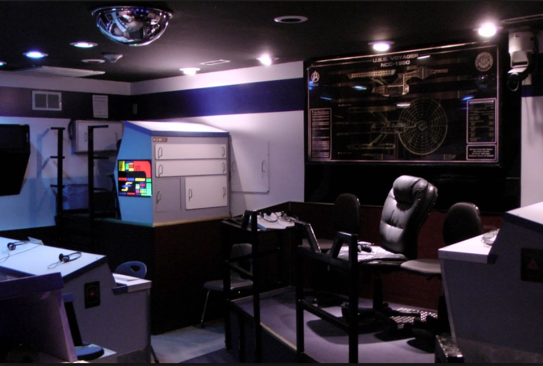
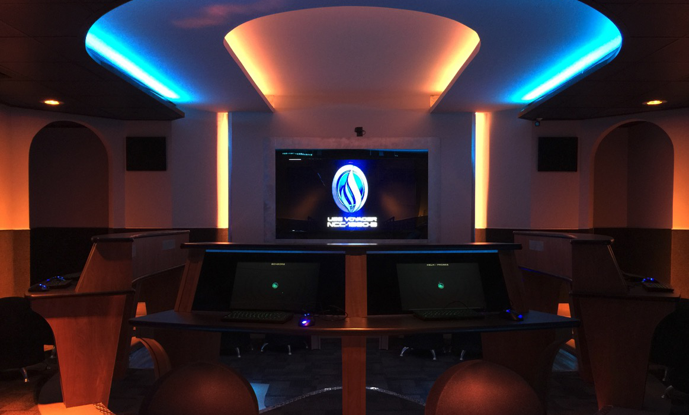

import BioComponent from './components/bio'
import Testimonial from './components/testimonial'
import Heading from './components/heading'
import SignupForm from './components/signupForm'

<Heading />
<SignupForm/>

## A Reimagining of Bridge Simulators

Do you remember the first time you flew in a starship simulator? I bet you can tell me, with detail, what position you were, what mission you flew, and whether you completed it successfully. These kinds of experiences stay with us for our entire lives.

---

<figure>

<figcaption>The USS Voyager, my first bridge simulator experience</figcaption>
</figure>

---

I've been building bridge simulation software since 2006, and Thorium Classic has been in development since 2016. I've learned a lot about how to build a simulator that balances action and narrative and provides the kinds of experiences that last lifetimes.

Thorium Nova is the product of everything I know about building great bridge simulator experiences for both crews and flight directors. It takes the best parts of Thorium, like the flight director controls and timeline, and combines them with exciting new concepts, like a 3D viewscreen and inter-ship crew maps.

These new paradigms are woven into every part of the controls, creating an entirely new, unforgettable experience — whether flying your flight at a space center, from home, or over the internet.

<figcaption>The USS Voyager Mk II</figcaption>

---

## What is a Bridge Simulator?

Bridge Simulators, like Thorium Nova, are cooperative live-action role-playing games set in space. Players act out the roles of a spaceship bridge crew, such as communications officer, navigator, or captain. They work together to complete a set of mission objectives.

In Thorium Classic, a flight director sits behind the scenes to act as a game master, controlling what happens inside the simulation, acting out the roles of aliens the crew encounters, and guiding the crew through the storyline.

Many bridge simulators, like Artemis or Empty Epsilon, focus on arcade action. Thorium Classic is suited for rich storytelling through talented flight directors.

Thorium Nova attempts to bridge the gap by offering rich stories in a dynamic environment, while staying simple enough for anyone to enjoy among friends in their living room.

---

<Testimonial
  quote="Thorium’s creation by Alex has been a long, yet rewarding adventure. His product has changed my workplace for the better."
  name="Jon Parker"
  title="Assistant Director of Simulations, CMSC"
  image="/images/jon.jpg"
></Testimonial>

---

## What's Included

Thorium Nova keeps the best parts of Thorium intact:

- Powerful flight director controls, enabling deeply emotional storylines and unscripted narrations.
- Expressive mission timeline builder for crafting storylines.
- Easy to use — just run on one computer and connect via web browser.
- First-class show control features, like DMX lighting and sound effects.

Thorium Nova also adds exciting new features:

- A Universal Sandbox which enables a beautiful viewscreen showing planets, stars, and ships in 3D space.
- Robust crew simulation, tracking the position and actions of every crew member on the ship.
- Powerful timeline automations, making flights possible without flight directors.
- Simpler, more approachable flight director controls, with a focus on helping beginners succeed.
- A sturdy networking architecture, making flights over the internet possible.

---

<Testimonial
  quote="Thorium enables the flight director and crew. I’m a natural storyteller and Thorium opens up a world of possibilities and opportunities for creative storytelling."
  name="Natalie Anderson"
  title="Set Director, CMSC"
  image="/images/natalie.jpg"
></Testimonial>

---

<SignupForm/>

## Frequently Asked Questions

### What is going to happen to Thorium Classic?

Thorium Classic will still be available and maintained for the foreseeable future. Thorium Nova does nothing to eliminate the value of Thorium Classic. On the contrary, things developed for Thorium Nova might end up making their way back into Thorium Classic.

In the event that Thorium Classic development has to cease, the project is open source so anyone can download the source code and make their own changes or fixes.

### When will Thorium Nova be completed?

Development started on Thorium Nova in the Summer of 2020, and will likely continue for at least a year before a playable demo is made available. Fortunately, many of the lessons learned during Thorium Classic's development can speed the development process of Thorium Nova.

### Why didn't you just build new features into Thorium Classic?

As I evaluated whether to build these new features into Thorium Classic, it became apparent that they would be a dramatic departure from the normal way of using Thorium. Instead of trying to wrangle Thorium to work with this new paradigm, I decided it made more sense to create an entirely separate product.

Doing so has a lot of benefits. We get to start over with the designs and functionality; old code in Thorium can be replaced with the latest technologies; poorly implemented or rarely used features can be removed entirely, making it simpler.

Also, this lets me focus my efforts on a product that appeals to a broader audience than brick and mortar space centers. Thorium Nova is designed with the hobbyist in mind.

### Will Thorium Nova be open-source like Thorium Classic?

Thorium Classic being open-source is one of my favorite parts about it. I love that anyone can examine and contribute to a robust set of simulator controls.

That said, it doesn't have a sustainable business model. Donations for Thorium Classic are relatively low, and external contributions are infrequent. It really has been a labor of love for me.

Thorium Nova will be a commercial product. You will pay to download the server software which you can use to run a simulation at home. Prices and terms haven't been decided yet.

If I get a substantial number of patrons — between 100 and 200 — on the Thorium Patreon page, then I will consider open-sourcing Thorium Nova.

### Where did that cool logo and cover image come from?

I made the logo myself, based on the original Thorium logo. That symbol is called the "Triquetra" and is associated with the god Thor in Norse mythology. Seems appropriate to use with a product named after the God of Thunder.

The cover image was also generated by myself in Blender, using a 3D model and planet texture which ship with Thorium and a procedurally generated background and ring system. This isn't exactly what the 3D viewscreen will look like, but I hope to make it at least somewhat close.

---

<BioComponent />

---