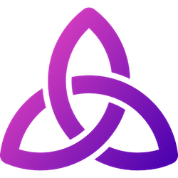

TL;DR: I'm making a new set of spaceship bridge controls called Thorium Nova - [sign up for the newsletter](/).

---

Six years ago, I started working on Flint, a set of simulator controls specifically designed to be used in the new USS Voyager II simulator that would soon be under construction. These controls were supposed to be the pinnacle of spaceship simulator software. Vast, detailed documents were written up explaining how each part of this simulator would work in the sci-fi universe in the most realistic way possible. A committee was organized and each meeting was filled with discussion and debate about the finer points of how it was all to work.

We had great plans. Every system interconnected; rich simulations and automations in both hardware and software; a beautiful 3D viewscreen; simulations of every crew member as they move through the ship (affectionately known as the Marauder's Map). Flint was an ambitious project.

Alas, Flint was never completed. Some aspects, like the lighting and audio matrix control, were implemented in the Voyager, but the controls themselves were never used in a flight.

I realized that many of the assumptions we made about our tech stack and designs were incorrect and if we followed the same course we would never find success. That's when I decided to start over fresh.

I called the new project Thorium, and I worked on it in secret. I knew that designing controls by committee would never produce results in a reasonable time frame. I also knew the bare minimum feature set that was required to run a space flight. With a plucky sense of optimism, I wrote the first code for Thorium just four years ago.

A lot has changed since then. Thorium is now in use at all five of the Utah space centers and an untold number of hobbyists. It's the first of its kind of simulator software to be open sourced and 14 people have contributed in some way. Not to mention the vast number of feature suggestions, feedback, and bug reports from Thorium's many users. Finally, we have a thriving community of over 200 people in Discord.

I frequently hear from users, both on the ships and in the control rooms, about how much they enjoy using Thorium. Never in my wildest dreams did I expect Thorium to enjoy this level of success. Thank you all for being part of this journey.

And like all journeys, this one is taking a new path.

## Introducing Thorium Nova

I've started work on a new, separate product under the Thorium umbrella which I call Thorium Nova. It takes a fresh look at the problems which both Flint and Thorium tried to solve.

When I started Thorium, I built it around the lessons I learned from Flint's failures. That's how I discovered the system which Thorium now uses for managing flights, simulators, and clients. But I didn't design Thorium around those more ambitious features, like the 3D viewscreen or Marauder's Map. Now that I've completed everything else that I've always wanted to include in Thorium, I've discovered that it isn't going to be simple to just plop it in.

These features touch every other aspect of Thorium in very complex ways. Adding them in would require a complete rewrite of everything, and likely wouldn't work with all of Thorium's current features. Some people will likely want to continue using Thorium the way that they always have, which is difficult to maintain while adding in the new and exciting features.

That's why I've decided to start over again. The difference is this time I already know what works and I know what to focus on. And I have an excellent community (that's you!) to work with to make sure I'm building the right thing.

But Thorium Nova is going to be different, there's no escaping that. Those of you who who are currently using Thorium will find that it takes away a lot of your control. You'll discover that it doesn't have as many options for configuration, or that some things are missing altogether. But those are good things.

Since Thorium Nova will now be properly simulating the movement of ships and crew, it creates an experience that is vastly more integrated and engaging than Thorium could ever provide. It automations will make the flight director experience easier, removing the need for fine-grain control. And writing mission timelines and stories will be easier, since all of the visuals will be automatically generated by Thorium Nova.

In short, it makes some tradeoffs, but I think Thorium Nova gets the better end of the deal.

That's not to say Thorium is going anywhere, or won't be getting any love! But the time has definitely come to try something new.

Want to learn more? [Sign up for the newsletter](/) if you haven't already to get regular updates about the state of development, along with a few exclusive goodies and offers, including access to a special channel on the Thorium Discord server.

I'll also be posting the newsletter updates to this blog, but the blog posts will be posted a week after the newsletter content, and won't include some of the exclusive content - that's what makes it exclusive!

Plus, you [signing up for the newsletter](/) helps me gauge interest so I know that I'm actually making something that people want.

This is going to be an exciting journey, and I'm thrilled to have you along for the ride!

Alex

