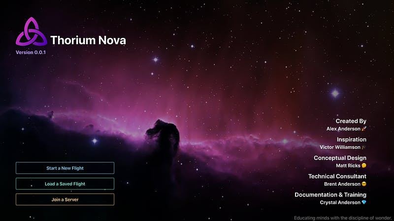

These first few weeks of development have been mostly conceptual. I have been developing Thorium Classic a certain way for four years, so with Thorium Nova I want to look at it with fresh eyes. Pretty much anything and everything could be changed or removed. A few examples:
​

- Most bridge simulators have a static list of crew stations; Thorium lets you configure stations to have as many or few as you want. What if Thorium Nova were to automatically generate the list of stations based on the ship you are flying and the number of crew you have?
- What happens when you only have 1 station?
- What happens when you don’t have a flight director?
- Do we need a login screen? Does it provide any value?
- How should assets, like pictures and sounds and 3d models, work?
- What does it look like if every ship on sensors is another fully-formed ship, like the crew’s ship, instead of just being a picture with a label?
  How can I simplify the experience for the crew and for the flight director?

If you have any thoughts about the above, let me know. 😉

​
Even though I’ve been doing a lot of thinking, I’ve been working on some code. So far, I’ve got a the basic architecture defined, along with a database mechanism and a way for clients to talk to the server. I’ve also created the splash screen that appears when you first open Thorium.

The goal is to make it as quick and easy as possible to start a flight and have people join you, whether over the internet or in your living room.

Photo by <a href="https://unsplash.com/@sushimi?utm_source=unsplash&amp;utm_medium=referral&amp;utm_content=creditCopyText">Susanna Marsiglia</a> on <a href="https://unsplash.com/s/photos/easle?utm_source=unsplash&amp;utm_medium=referral&amp;utm_content=creditCopyText">Unsplash</a>

