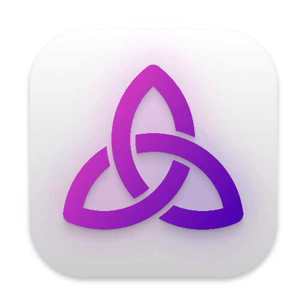

This week was spent on foundational aspects which will make the controls robust and expandable, specifically an automated testing framework and internationalization (i18n) support.

Thorium Classic is a great set of software, but it does have many bugs. Sometimes I'll create new features or fix bugs to find other bugs pop up in their place. These are called regressions, and it's the most frustrating thing to deal with. If you look at the history of Thorium's releases, you'll find a few weeks where there are 3 or 4 releases in a short timeframe. That's usually because I introduced a few bugs in one release that I rapidly fix for future releases.

Fortunately, an automated testing framework can help find these regressions before they become a problem. I've basically taught my computer how to use Thorium Nova, which allows it to go through and make sure each button and control is behaving the way it is supposed to. I've set up a hook to make it so whenever I make changes, it runs the test suite. If any of the tests fail, the whole change is rejected and I have to fix the problems. This means more development time, since I have to write all the tests, but in the end Thorium Nova will be more stable with fewer bugs.

Another area where Thorium Classic is lacking is i18n support. This is what allows programs to be displayed in multiple languages. To do this correctly, every string of text has to be wrapped in the translation function. This function looks at a list of strings for the language the user is using and grabs the one for the specific control. By building Thorium Nova with i18n built in from the beginning, adding new languages will be as easy as having a translator swap out all of the strings.

Finally, I created a few icons for Thorium Nova. Which do you like the most?

Icon 1

Icon 2

Icon 3

Icon 4

Icon 5

