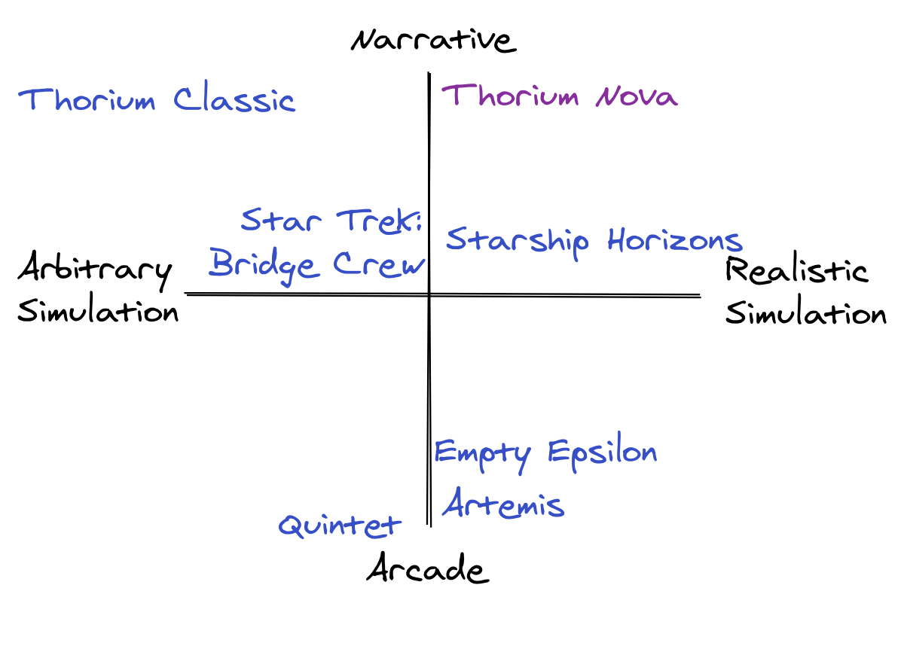

When I was 7 years old, I experienced my first bridge simulator. My brother, inspired by his recent Space Center field trip, pulled our living room sofa away from the wall, draped blankets over the top, and created a Spaceship Bridge Simulator. He grabbed the boom box and a bunch of soundtrack CDs to set the mood. He found all kinds of gizmos and gadgets to be used by the crew to activate the ship’s systems. Finally, he plopped his little brother (me!) inside to be the crew; he stayed outside to run the simulation as the Flight Director.

I don’t remember anything about the storyline or what aliens we encountered, but the feeling I felt afterwards was exhilarating. From that moment on, I was hooked.

Since then, I’ve been part of many more bridge simulator sets. Some happened in living rooms; some in multi-deck sets designed to emulate the dimensions of a real starship. Some were simple — nothing more than a box on wheels. Others were elaborate, with interconnected hardware and software and special rooms for sickbay and engineering.

The one thing that tied them together was the awe of flying a spaceship.

---

At its simplest, a bridge simulator is an experience where a group of people work together to operate a simulated space ship. It’s like Dungeons and Dragons in space, where each player has a different role along with a mission that drives the actions of the characters. This could be done with low-budget tools and imagination, but modern software makes it possible to simulate the bridge controls with great fidelity.

This software creates a real-time simulation of what is going on in space. The controls which the crew uses provide instant feedback, making them well suited for action-packed space action

Some people might say cockpit simulators, like Elite Dangerous, or space exploration games, like EVE Online count as bridge simulators. I disagree. One of the appeals of bridge simulators is the cooperative multiplayer aspect of it. You can’t effectively play the game by yourself — it requires a team of people, each performing different tasks, to complete the mission successfully.

## Arcade vs Narrative Action

Bridge simulators exist on a spectrum between arcade action and narrative. On the arcade action side, the simulation exists to fly around and blow up bad guys with a few other objectives sprinkled in the mix. On the narrative side, a Flight Director sits behind the scenes to coordinate the actions of the crew and NPCs in the simulation while telling a story. The Flight Director can send messages to the crew, plays the roles of all the NPCs which the crew meets, and guides the crew to the next objectives of their mission.
Another spectrum is between realism and fiction. Simulating the behavior of ships in the vastness of space, even technologically advanced ships, is actually really hard to do while maintaining any semblance of action and enjoyment.

This leads to questions of where to draw the line. Should travel time between solar systems be as long as it would be, even when traveling at superluminary speed? That would mean it would take hours, if not days, to get from Earth to the nearest solar system, hardly an acceptable time frame for a 60-minute bridge simulation. What about dangerously navigating through an asteroid field? In reality, asteroids are so distant that the chances of successfully navigating an asteroid field are much better than 3,720 to 1. That means aspects of the simulation either have to be fudged, or ignored completely.

Different bridge simulators approach this differently. Thorium Classic ignored realism entirely, relying on the whims of the flight director to determine travel time, the size of planets, and how much damage a ship might take when hit by an asteroid field. You want a densely packed asteroid field? Sure! How about a Celestial Death Storm? Whatever you want! Since Thorium Classic operates off of the imaginations of the crew with help from the Flight Director, much more is possible.

This puts a lot more burden upon the Flight Director, though. Not only do they have to keep the entire universe in their head so they know what cues to give the crew, but they also have to know exactly what buttons to push and what controls to manipulate to make the controls reflect what is really going on in the universe.

## Live-Action Roleplay

One interesting possibility bridge simulation lends itself to is live-action roleplay, or LARP, where each of the crew members role-plays their job on the ship. Part acting, part improvisation,LARP-ing takes the experience to the next level by giving the crew an even deeper connection to the narrative. They might create a unique character for themselves, with an involved backstory which they can draw on as they act out their part.

LARP-ing can only go so far when your bridge simulator is in your living room, but you can get creative. I once did a bridge simulation where the crew crash landed on an alien planet, and needed to get more water, as well as a specific part from the nearby settlement to repair their ship. We dressed up my friend’s house to look like an alien scientist’s lab. We gave the crew a bunch of very strange outfits, claiming that they would help the crew blend in (they did not). While half the crew went to get the part, the other half was given some money and sent to the local convenience store to purchase a single water bottle. Needless to say, hijinks ensued. Our crew played their parts marvelously, and the away mission was a great success.

Other bridge simulators demand much more dedication from their crews. The [Outbound Hope simulator](https://outboundhope.com/) brought over 80 crewmembers aboard and gave them diverse positions like Press Corp, Marine, and Medic. Many of these crew members didn’t even use bridge simulation software, but still played an important role in operating their ship.

## Thorium Nova’s Approach

Thorium Nova will attempt to take a different approach, trying to land a little bit more on the side of narrative and realism. Distances and speeds will be fudged such that the narrative can move forward at a reasonable pace. Many things which were the responsibility of the Flight Director will be automated by the simulation - things like ship repairs, moving NPC ships around, and NPC crew member interactions.

In fact, Thorium Nova will be designed such that it can be run without a Flight Director altogether. However, the best experiences will happen with a Flight Director present; without the distractions of unnecessary responsibilities, the Flight Director can be fully engaged in telling a great story to the crew.

This is all possible because of the 3D Star Map which will simulate everything happening outside of the ship, and the crew simulation which will simulate the interactions of everything happening inside the ship. Look forward to hearing more about these features in future blog posts.

## So What?

Why should anyone care about bridge simulations? For one thing, they provide a cooperative experience that is hard to replicate in other settings. In many cooperative games, anyone can take over for one of their teammates if necessary; in a bridge simulator, only the helm officer can steer the ship. Without the helm officer there, the crew would most certainly crash into one of the asteroids. Not only is there more pressure, but there is also more satisfaction when the mission is completed successfully.

Narrative bridge simulations offer even more — a real story with real consequences requiring real investment. The crew can’t just sit back and enjoy the show — they can go to a movie for that. And it’s not about running around and shooting bad guys — that’s what laser tag is for.

No, the crews should expect to get into character. They should feel invested in what is going on and what they are doing. They each should have a moment to shine, to feel like they made a real difference in the mission, that they were a crucial part of the team.

That’s what, in the words of my mentor Victor Williamson, bridge simulators can do for a crew. “Our rides continue well beyond the time spent in the ships. The mission residue continues for years to come as stories pass from person to person on the semi-shared experience.”
