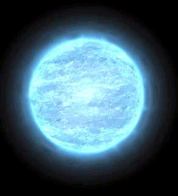
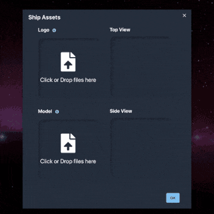

Major progress was made this week on the Star Map. This is the centerpiece feature of Thorium Nova that shows the crew a view outside their ship. I'll be writing an essay about the Star Map in a future newsletter. Before they can see the stuff outside, though, it has to be created. That means a star map level editor of sorts. While I've made a lot of progress on the level editor, I don't have anything to show quite yet. Stay tuned!

I did make some progress on the 3D objects that will inhabit the universe, including a star.

This is just one variety of star, but the appearance could easily be altered to match any type of star. I'm planning on making it so stars that we're most familiar with are represented in Thorium Nova - Rigel, Vega, Eta Carinea, Betelgeuse, and of course our wonderful home star Sol. I want to give you the chance to suggest your own system names. If you have a good idea, [fill out this form](https://docs.google.com/forms/d/e/1FAIpQLSck6FQrxmT_7GBn4sIbgn4136dSn3BucnwuKJtAW196FxcjEg/viewform?usp=sf_link) with the name. I can't guarantee that it'll be added, but if I do add yours, I'll include your name in the credits.

Finally, I worked on an interface for uploading a logo and model for the ships in the 3D universe. Since I have the model, I can easily generate a side and top view without any other input from the user. This hopefully will make it really easy to add new ships.
