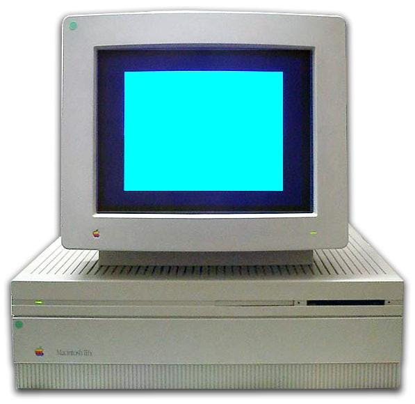

The thing that sets Thorium Nova apart from other bridge simulators most is the Flight Director. Comparable to a Dungeons & Dragons Dungeon Master, it is the Flight Director's job to monitor the crew, update the simulation based on their actions, and drive the story line. What are the qualities of great Flight Directors?

<iframe width="560" height="315" src="https://www.youtube.com/embed/UzpI5ffl5Jc" frameborder="0" allow="accelerometer; autoplay; encrypted-media; gyroscope; picture-in-picture" allowfullscreen=""> </iframe>
<small style="text-align:center;">Once I had to run a bridge simulator by myself. Hijinks ensued.</small>

## Storyteller

The Flight Director’s primary responsibility is telling a good story, which starts with having a good story to tell. In Thorium Nova, these stories can be recorded as Missions, but a Flight Director could choose to wing it, so to speak, and use the Core computer to directly manipulate the simulation to tell whatever story they want.

Good Flight Directors, like good storytellers, know that the best stories have a hook (the mission briefing), conflict, rising and falling action, memorable characters, a dramatic climax, and a satisfying ending. Their job is to use every tool in their arsenal – Short Range communications over a microphone, long range messages, memos from the lower decks, sensors information, music, and sound effects – to engage the crew in the plot and lead them to success.

## Actor

In Dungeons & Dragons, the best DMs and players are the ones who really get into character and play their role well. For the Flight Director, just like the DM, this means playing a variety of characters in many different ways. This includes the shipboard computer, the helpful know-it-all chief engineer, the starbase commander, the alien warlord, the curious scientist, and everyone in between. Most of these roles are played over the main speakers when talking to other ships using the Short Range Communication system.

To help with the believability, many flight directors use voice changers, such as the [VT-3](https://www.roland.com/us/products/vt-3/) or the [voice changer built into software like GarageBand](http://dreamflightadventures.com/resources/simulator-software/flight-director-voices/). Thorium Nova will hopefully ship with a built-in voice changer that the Flight Director can use.

## Guide

While the Flight Director should be willing to leave the crew to their own devices, they should also know when to step in and guide the crew along in the mission. This includes helping crew members use their stations, using the Chief Engineer character to point out a detail the crew might have missed, or sending a long range message from HQ to remind them what their mission objectives are. The Flight Director needs to pay close attention to make sure each crew member knows exactly what they should be doing at any point during the mission.

## Technician

There’s a lot of technical things a Flight Director has to address, most importantly the Core controls! They need to know how Core works and how to manipulate it to advance their story. They also have to deal with lights, speakers, microphones, cameras, and all of the crew’s computers too.

## Disc Jockey

What is an intense mission without intense music? It may seem counterintuitive, but the music makes a huge difference in helping the crew feel like they are really there. It sets the mood for the crew and cues them to know how they should feel at a particular part of the mission. Flight Directors often have vast stores of music which they can call on to score a scene just right.

Thorium Nova will have a music player built in, and will ship with tracks that are appropriate for travel, battle, running away, scary moments, and moments of triumph.

## Second Chair / AuxCore / IIFX

These terms are often bandied about when referring to a second Flight Director who works alongside the primary Flight Director. Second Chair is the official title, while AuxCore refers to the alternate Core screen which the Second Chair uses to control their parts of the ship. IIFX is an antiquated term from the Christa McAuliffe Space Center which refers to the actual computer the AuxCore ran on – a Macintosh IIFX.

<small style="text-align:center;">Apparently a very advanced computer.</small>

Second Chair is typically responsible for anything not directly related to the primary storyline; in other words, the second storyline. This includes random encounters that happen inside the ship for security teams, sending long range messages from HQ to request mission updates, and supervising the progress of damage reports.

If a mission calls for additional actors to play roles during the mission, such as intruders or alien diplomats, the Second Chair also coordinates those actors. They instruct the actors as to what they should say and do, and gives direction to help them stay in character as the actors improvise while on the bridge.

Thorium Nova will mostly do away with the role of the Second Chair, as most of the functions in the ship will be automated such that an extra person won’t be necessary to run a flight. However, if a Flight Director still wanted to have an extra helper, the Core controls could be pulled up on another computer for a Second Chair to use.

---

There are a lot of things Flight Directors have to do to be successful. Fortunately, Thorium Nova will make many of those things easier. With better Mission Timeline automation, a totally re-imagined Core, and better training for the Flight Director and crew, any decent Dungeon Master can feel successful as a Thorium Nova Flight Director.
