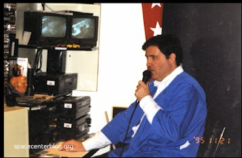
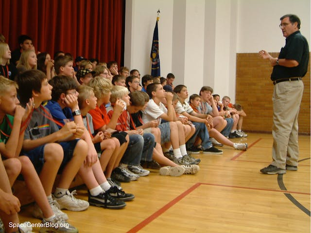

Science, Technology, Engineering and Math (STEM) education is part of Thorium’s DNA. Thorium was originally created to be used as part of the school field trip programs that happen at the [many](https://spacecenter.alpineschools.org/) [space](https://www.thelionsgatecenter.com/) [centers](https://www.discoveryspacecenter.com/) [in](https://realitysedge.org/) [Utah](https://www.spacecamputah.org/). These space centers were founded on the teaching style of Victor Williamson, who learned how to “educate young minds through the discipline of wonder.”

<small style="text-align:center;">Victor Williamson, the original Flight Director. Photo courtesy <a href="https://spacecenterblog.org">spacecenterblog.org</a></small>

When he first began running spaceship simulator programs for the students he taught, they followed a simple storyline: Visit each of the planets in the solar system; discuss the properties of the planet and how we use that information to learn more about the universe; move on to the next planet. While the students enjoyed the experience, it wasn’t as engaging as Mr. Williamson hoped.

In a stroke of genius, he spliced a video of a Romulan Warbird decloaking in orbit of Mars in a threatening position. Suddenly, this wasn’t a simple recon mission; the crew faced real danger! They jumped into action, dispatched the foe, and cheered with joy at the end of their mission.

What changed? The mission was no longer a simple follow-along astronomy lesson. The narrative encouraged the crew to engage with the content. While they were on the lookout for more Romulan scouts, they were also paying attention to the science principles in the mission. You could say Mr. Williamson added the Arts to STEAM education.

Thorium Nova takes these principles to heart. Education is an important goal, but without incorporating narrative storytelling, it can fall flat. By building Thorium Nova as a game first, the simulator is better equipped to teach memorable, meaningful STEM principles.

Video games as a medium provide a unique format for both education and entertainment. Unlike books and documentaries, video games excel at indirect communication and teaching.

Video games that directly teach math or science are often offputting. But if you’ve played the Oregon Trail, I bet you can tell me several trials the emigrants faced as they crossed the continent. Was that a direct result of the Oregon Trail overtly trying to teach you social studies? No. It’s more likely you picked it up after dying of dysentery for the hundredth time.

<small style="text-align:center;">Not again</small>

While Bridge Simulators and Thorium Nova both provide meaningful fun and entertainment, they also are a great venue for channeling educational content. In Thorium Nova, I see four different avenues for STEM education:

- Integrated STEM
- STEM-based missions
- Ancillary experiences
- Content Creation

## Integrated STEM

The most direct method of education in starship simulators is programming the principles directly into the controls. This doesn’t have to be entirely blatant, like having the crew answer math questions to activate their engines. If thoughtfully considered, these integrated lessons can fit well and teach the principles even better.

Take course calculation for example. To get to your destination, two things have to happen: the ship has to be rotated to point in the correct direction, and the engines have to be activated to the appropriate speed so you get there in good time without passing your destination altogether.

For rotating the ship, the navigator has to understand the relationship between angles and directions. The pilot will have to calculate the distance to their destination to choose an appropriate speed. These things are built into the controls and cannot be altered from mission to mission.

The hope is that these elements blend seamlessly with the regular operation of the controls such that the crew doesn’t immediately recognize the subtle STEM principles they are learning. It won't be until later when they are faced with a similar problem that they think back to their Bridge Simulation experience and realize what they learned.

## STEM-based Missions

The mission storylines themselves offer the greatest opportunity for the Flight Director to dictate a principle for the crew to learn as part of their Bridge Simulation experience. Many of the things the crew does will be science fiction - that’s what makes the game appealing! But there are still plenty of real things the crew can learn along the way.

For many missions, this will be astronomical information which will continually be available throughout the course of the mission.They’ll have the chance to travel to REAL stars with accurate qualities and descriptions. Most planets they go to will be fictional, but their properties will be based on real scientific facts and principles. The fantastic elements of the story will be told with a backdrop of real science.

On top of that, and possibly more importantly, the Flight Director can teach more than just science. The greatest storytellers weave morals and themes into their messages, and Flight Directors should do no differently.

One of my favorite missions is called Intolerance. An escaped slave has emerged from a new wormhole and requests political asylum. The slave master follows close behind, demanding the return of his property. The crew has to choose a side: will they respect the property rights - implying that a person is property - of the slave master? Or will they stand up for the freedom of the individual at great cost? The climax is especially profound.

## Ancillary Experiences

There are some things crews learn just by being in the simulator. The fact that Bridge Simulators require the crew work together means they can’t help but expand their teamwork and communication skills. Captains will learn what it takes to be a good leader. Every crew member will face challenges which will test their problem-solving skills.

Crews will also be inspired by their bridge simulation experience. I can’t tell you how many times I’ve met someone who, when they found out my involvement with the space centers, said “Oh, I went there when I was in 5th grade. I was the **insert bridge position** officer, and we had to **insert vague mission detail**!” Their experience lit a fire which still burns to this day. Mr. Williamson has had many of his past students return and tell him that the Space Center made them want to be scientists or teachers. This kind of learning is hard to measure, but the impact is definitely felt by the crews.

<small style="text-align:center;">Just a few of the many lives touched by Victor Williamson's approach to education through simulations</small>

## Content Creation

There’s a lot to learn outside the simulators too. Since Thorium will have an open plugin architecture, there will be plenty of opportunity for people to build content of all varieties. If I’ve learned anything, having an opportunity like this will encourage people to learn the skills needed to accomplish what they want. I first learned how to use Photoshop while creating plugins for the old Escape Velocity games; hopefully Thorium Nova users will do the same.

Those interested in writing could create new missions to be shared with others; some could learn how to create 3D models for the ships or illustrations for the ship systems; sound effects and music could be created by budding sound designers and composers.

---

There’s a lot to learn out there. The things which Thorium Nova has to teach the crews that use it might be limited, but the experience of learning them in a Bridge Simulator will make those lessons have lasting impact in the lives of every crew member.
