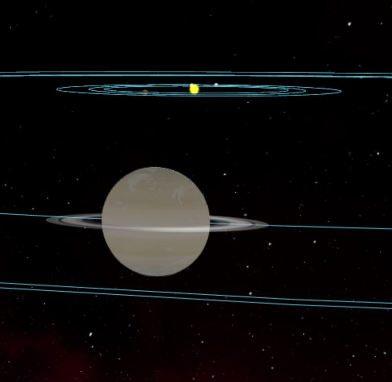

When you’re in space, you would expect to see the majestic sights of stars and planets, nebulae and other celestial objects. Thorium Classic can pretend to show you those amazing sights by playing static video clips, but the experience is not as engaging as a real star map and 3D universe.

I’ve been [wanting to have a star map](https://github.com/Thorium-Sim/thorium/issues/79) in Thorium since before I started working on it, but my primary goal for Thorium Classic was to complete a set of simulator controls at all costs. As it turns out, a 3D star map is a foundational element of the controls, not something that can be tacked on later. Everything has to be reconsidered and developed from a different point of view. This is why I gave up on adding the star map to Thorium Classic and started making Thorium Nova.

You might be asking “What makes the 3D star map so cool?” Hopefully this can impart my vision for the star map and why I think it will revolutionize bridge simulations.

## It tracks the ship’s location in interstellar space

Most bridge simulators have a limited “play field” that the entire flight takes place in. You can fly around this area as much as you want, but there isn’t much to do in terms of traveling between solar systems. There aren’t even solar systems to travel to!

Other bridge simulators do allow you to jump between systems, but the travel time is near-instantaneous, and the location of the crew’s ship in interstellar space instantly jumps. There’s no possibility of stopping half way to your destination or changing course mid way.

Instantly arriving at your destination might sound like a good idea, but for flights any longer than an hour or so, that travel time is an important part of the narrative experience. It gives the crew time to relax, regroup, and process what’s going on. There are also story possibilities for getting ambushed half-way to a destination or running out of fuel and needing to hail down a passing merchant ship; hopefully they won’t steal your chairs in the process.

That’s why Thorium Nova will continuously track the position of your ship across its entire journey. At any moment, you can see your position on the star map, stop your ship, change course, and continue on your way. This presents a number of challenges, though.

Speed has to be carefully considered. If Thorium Nova uses realistic distances, traveling between planetary systems in a reasonable amount of time would require absurd speeds. To get from Earth to the closest star, Alpha Centauri, in about 4 minutes, you would have to travel at [577,000 ⨉ the speed of light](https://www.wolframalpha.com/input/?i=sun+to+alpha+Centauri+distance+%2F+4+minutes)! At that same speed, you could travel from Earth to Neptune, the farthest planet, in less than a second!
Also, having any kind of meaningful interactions between other ships means those ships have to be very close to each other, and travel at slow speeds.

That means that speeds will be regulated at different levels of space. At a local level, like within orbit of a planet or near other ships, you could use an impulse drive with a maximum speed of roughly 300 km/s. That’s too slow to even get to nearby objects, though. It would take [22 minutes to get from Earth to the moon at that speed](https://www.wolframalpha.com/input/?i=earth+to+moon+distance+%2F+300+km%2Fs)!

That’s where an FTL drive comes in, like a Warp Engine or Hyperdrive. Within a solar system, you could use its lower speeds to travel between objects and planets. Faster speeds will be reserved for interstellar travel, which would allow you to move between stars in a reasonable timeframe. The system might automatically pick a speed for you based on how far you are going. Using the FTL drive would be limited in other ways too, such as making it take a long time to warm up, making it inconvenient for trying to make a quick getaway when the crew is under attack.

Another interesting suggestion which one of the newsletter subscribers made was incorporating [Legrange points](https://en.wikipedia.org/wiki/Lagrangian_point) which are gravitational hot spots. The idea is that you can travel to a Legrange point, and then immediately start using interstellar FTL speeds without having to first leave the solar system.

I do intend to also add a Jump drive, which would effectively allow the crew’s ship to move instantly from one place to another without actually traveling linearly through space. The crew would activate the Jump drive, and at the Flight Director’s discretion they would pop out on the other side, thus enabling more storytelling opportunities.

And, to make the Flight Director’s job easier, it will be possible to adjust a global speed constant, to make it so ships travel faster or slower. This can help set the pace for a particular mission, or let the Flight Director speed up a part of the mission based on the crew.

## The 3D Sandbox Viewscreen

Now that we’re tracking the position of the ship in space, we can easily create a window into space to see what’s out there. Stars, planets, moons, other ships, space stations, wormholes, nebulae, black holes, asteroids - whatever you can think of. I want your crews to be able to see and experience it all.

The hope is to make it so everything in the 3D Viewscreen is beautiful. It won’t necessarily be Hollywood quality, but it will be good enough that it doesn’t break your crew’s suspension of disbelief. I’ll be sure to include lots of pictures of the objects as I make them and add them to the 3D star map.
Deep integration with controls

The 3D star map is the centerpiece of Thorium Nova. All of the controls will be connected to it in some way. Firing phasers will actually cause a beam to shoot out of your ship on the 3D; launching a shuttle will spawn an NPC ship that will fly off, following whatever orders you gave it. Probes will continue to relay data to the ship wherever they are, even from distant systems. The possibilities for integrating controls that already exist in Thorium Classic are endless.

## Rich scannable properties

Since a lot of Thorium Nova will be automating things which Flight Directors have typically done, a lot more random data about things in the universe will have to be transferred from the Flight Director’s brain into Thorium Nova. That includes the temperature of stars, the classification of a planet, the number of lifeforms on an NPC ship, or even the last known course of a fleeing enemy. When objects, like stars and planets are created, they’ll automatically generate a lot of the properties based on simple heuristics. Red Giant stars will be roughly the correct size and temperature; Class M planets (like Earth) will be located within the Habitable Zone of the system, which is based on the radius and temperature of the stars in the center of the system. Then, the Flight Director can customize to their liking.

Of course, Thorium Nova will also come with a pre-generated universe so Flight Directors can just get started writing flights.

## Automated NPCs

A universe like this is bound to be populated by other ships, which means there will have to be some automation to control their movement and behavior. This will be based on the ship’s systems, the faction of the ship, and perhaps a few hidden properties. I haven’t figured out exactly how this will work, but I am trying to come up with ways for Flight Directors to program their own behavior logic.

## Multi-bridge flights

If every ship in Thorium Nova can be turned into a player-controlled simulator, adding multiple bridges becomes trivial. Two or more ships could cooperate (or compete) to complete mission objectives, expanding the excitement of the game even more.

---

There are so many other possibilities which haven’t even been explored yet. I would love to hear what you think - what things should be possible with the Starmap? Now that I’m finally getting to work on this, I’m excited to see how it turns out.
