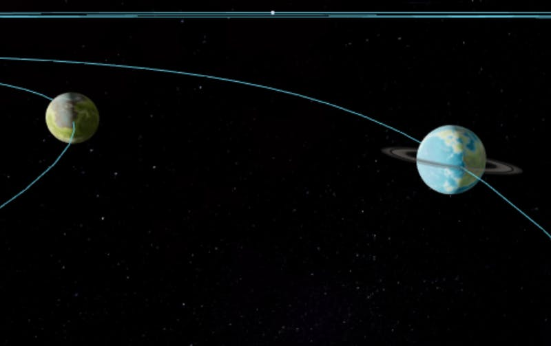

I've got more Starmap to show off.

Thorium Nova now allows you to create planetary systems. When you click "Add Star" or "Add Planet" inside of a system, it lets you choose a classification, such as "Red Giant" or "Class M" (which is a planet like Earth). The star or planet will have a correct temperature, radius, color, and in the case of planets, be correctly placed based on the habitable zone of the system.

I haven't built it yet, but after creating the star or planet, the Flight Director can change any of the properties which make up its appearance or orbit. I designed the defaults so the Flight Director doesn't have to come up with every single property themselves.

Even with the little work that I've done to make the planets look good, I've gotta say - _they look pretty good._

Of course, Flight Directors can provide their own textures for the planet surface, clouds, and rings, so this is highly customizable.

One thing that I've gone back and forth on is whether planets and stars should be drag-and-droppable. It certainly adds convenience to the Flight Director, but also makes it really hard to determine the properties of the orbit. Should it be more elliptical, or completely round? What direction should the orbit be tilting? Instead, Flight Directors access the orbital properties through the property palette. Changing the position of the planet will require the flight director to change each of those values until they are satisfied with the result.

### Assorted Answers

Space Battles will definitely be slower, and will only happen at impulse speeds around planets, or while chasing another ship. That helps avoid any weird relativistic effects and makes it so beam weapons hit instantly. Projectile weapons will most often have homing systems built in, so they'll automatically follow the targeted ship. Ship health will be a combination of shield strength, which can be recharged, and hull integrity. Ship systems will be individually targetable, so you can choose to take out the engines and weapons on an enemy to disable them without destroying the whole ship.

Chases will be much like setting a course anywhere else. You'll see the ship you want to chase on the Starmap (this will require some kind of transponder to be on the ship you want to chase). You'll set course to that ship and activate the engines. At this point, some things will automatically be handled for you, like minor thruster adjustments or changing the engine speeds to catch up and then match the speed of the other ship. From there, you'll be in range of the other ship, so you can communicate, transport objects, or fire weapons.

I've decided I'm going to use traditional names, as opposed to Beyer designations, for stars in the built-in Universe. Traditional names culture that I would like to convey to the crews that read the descriptions of the stars. For example, did you know that the name "Aldebaran" is Arabic, which means "The Follower" because it appears to follow the Hyades star cluster. That's a fun fact! Besides, if you say these names are arbitrary, so are the constellations which comprise the second half of the Beyer designations.
