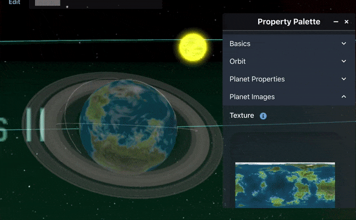
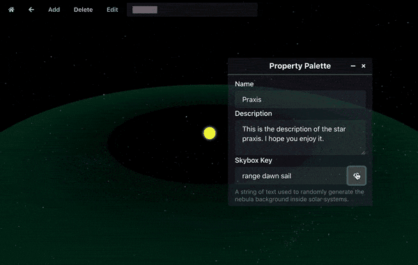

I've completed most of the preliminary work on the starmap editor. You can now add planets and stars, change any of their properties, and change the texture of planets.

I still need to add moons, but I imagine that won't be very difficult. After that, the only thing I have left to do before I move on to different work is adding a measurement tool to make it easier to find the distance between two objects. This will be useful for Flight Directors trying to determine travel time between two locations.
I also made it so the background nebula could be changed using a seed for a random number generator. Each planetary system can have its own background, defined by the seed value. There are infinite possibilities for what the nebula could look like! I added a little randomizer button which lets you quickly switch between different seed values.

