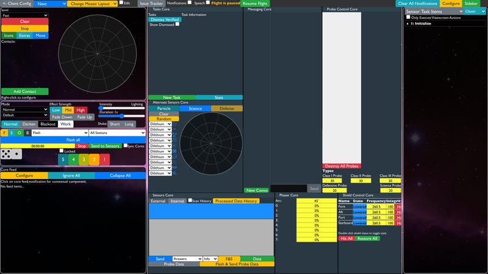
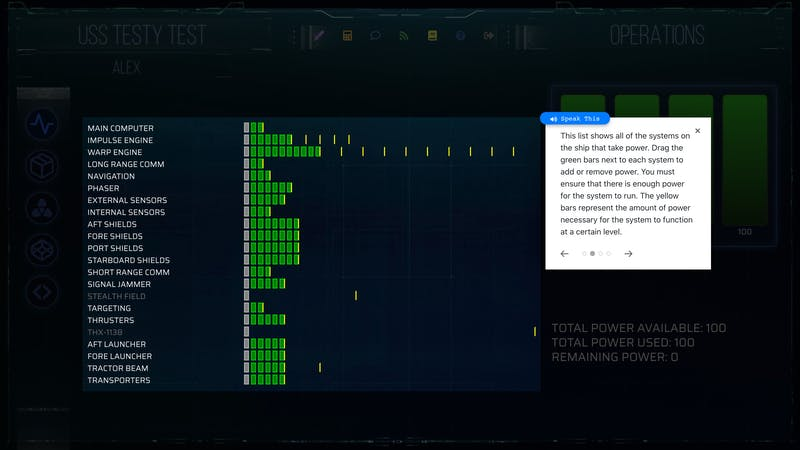

Thorium Nova is a completely new take on spaceship bridge simulators, but that doesn’t mean it doesn’t have anything to learn from Thorium Classic. In fact, I’ve said several times that many of the things that make Thorium Classic great will just transfer over to Thorium Nova. Here are some of those things.

## Powerful Flight Director controls

The flight director is at the heart of everything in Thorium Classic. Without the flight director, you could turn your engines on and fire your weapons, but you wouldn’t get anywhere or do anything. It takes a Flight Director to breathe life into the simulation.

That said, one of the things that most intimidates new Thorium Classic users is the Flight Directors’s core screen. There’s a lot of widgets and components to remember.

<small style="text-align:center;">That does look a little daunting, doesn't it?</small>

The Flight Director’s role will be a little different. Because of the automation and simulation built into Thorium Nova, the Flight Director won’t be as hands-on with the controls. Whatever core controls they do use will be simple and user friendly. These two adjustments allow the Flight Director to focus directly on the crew, making sure they are on track and having fun.

Thorium Nova will also have the ability to run flights without a Flight Director, but the experience will be much better with a Flight Director around.

## Easy to Use

One appeal of Thorium is how easy it is to get everything running. All you need is one computer to run the server and web browsers on all the other computers. That’s it! Thorium Nova will be no different. Run it from a browser, or use the integrated kiosk for more immersive experiences.

What’s more, Thorium Nova will have first-class support for missions flown over the internet, with built-in instructions for setting up your network to allow for your crew to connect to your server from anywhere in the world.

## Configuration and Customization

Let’s be real - everyone has their own vision for how bridge simulations are supposed to look. Forcing everyone to fit into the same cookie-cutter mold means every experience is going to be roughly the same, and that’s no fun. Thorium breaks this mold by making every aspect of the simulation can be tweaked; Thorium Nova will do the same, but in a much bigger way.

Plugins can modify nearly every aspect of the simulation, from the universe starmap to the various factions which the crew will meet to the properties of the ship systems to the theme which adds style to the crew’s computer screens. All of these will be configurable with intuitive editors built right into Thorium Nova. Plugins can be exported and shared, or even (eventually) sold on a plugin store. Look forward to a future essay about how plugins will work.

That doesn’t mean you need to configure anything before starting a flight. Thorium Nova will ship with several missions and dozens of ship templates — everything you need to dive in and get started.

## Mission Timelines and Actions

Timelines are what make it easy for Flight Directors to stay on track while telling stories. Thorium Nova will expand on timelines, adding more actions (what used to be called “macros” or “timeline actions”) and automated triggers for advancing the timeline, all while making it easier than ever to create and compose timelines together.

## Built-in Training for Crews (and Flight Directors)

Thorium Classic has training built right in for every card, which makes it really easy for crews to remind themselves how to use their stations even after the simulation has started. Thorium Nova will provide an enhanced experience, guiding each crewmember through their various controls to ensure they know how to do their job before embarking on their mission. Thorium Nova will also include built-in documentation and on-screen training for the Flight Director.

<small style="text-align:center; margin-bottom:2rem">Built in training makes it easy to remember how to do your job.</small>

And that’s just the tip of the pulsar! Thorium Nova will also include

- An open GraphQL API, making it easy to connect and integrate third-party programs and hardware panels
- Configurable stations with a variety of sci-fi inspired screens and systems for the crew to use
- Controls for managing and interacting with NPC crewmembers inside the ship.
- First-class show control support, including background ambiance, sound effects, music, and lighting effects.

I’ve learned a lot making Thorium Classic, including how to recognize a good thing when you have it. While Thorium Nova may be dispensing with many of the features of Thorium Classic, many of the things that make Thorium Classic so good will still find their way to Thorium Nova.
