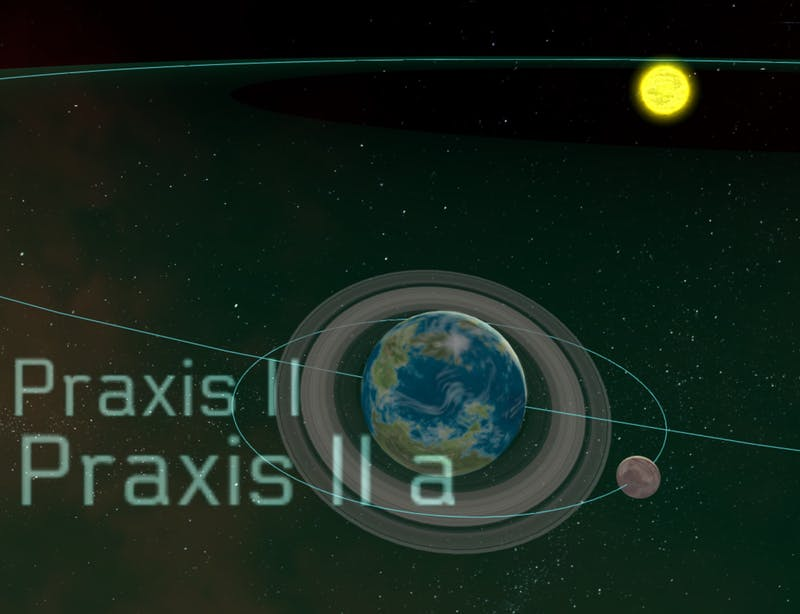

Like I mentioned last week, my goal for this week was to add moons and a measurement tool.

Moons can be added to any planet, but only one level deep - you can't add moons to moons. Outside of that, moons behave exactly the same as planets, except they orbit another planet instead of orbiting the center of the system.

I also added the distance measurement tool, which works by selecting an object, clicking the 'Measure Distance' button, and then hovering over another object. A line appears with the distance shown at the midpoint of the line. This makes it easy too see distances. Eventually, it will also show you roughly how long it would take to travel the distance at cruising speed, but I haven't decided how fast I want the engines to go yet, so I'll add that in later.

Finally, I wanted to include a search bar which could be used to find any object in the star map easily. Just type in the name of the object and choose it from the list. Once you choose it, you'll be teleported right to where the object is.

