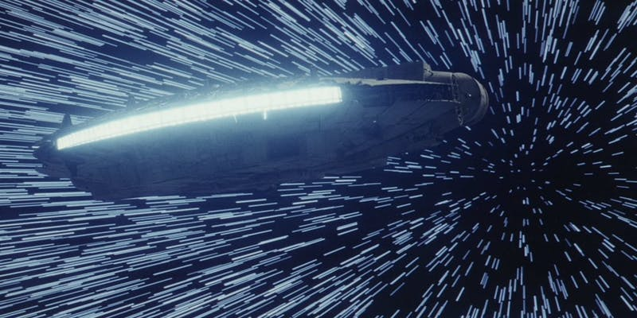

One of the most exciting things about Thorium is how much can be configured. I wanted to make it so you could believably have one flight that takes place in the Star Trek universe, while a completely different flight could happen in the Star Wars universe. Sure, the controls you are using would be roughly the same, but you could change the layout from a sleek Starfleet ship to a worn Corellian freighter; you could make the Warp Engines become the Hyperdrive. Phasers become blasters, the ship image changes, and suddenly there you are - flying in a galaxy far far away.

<small style="text-align:center; ">Warp drive? Where we're going, we don't need warp drive.</small>

The trouble with that is just how much configuration was necessary for Thorium to be useful. All of those things have to be painstakingly crafted, which requires a lot of time and dedication for anyone wanting to fly their ship. Plus, transferring configurations between ships, or even between Thorium servers, turned out to not work very well.

Thorium Nova is going to try something different. It will use a plugin system to keep track of any template data that defines the universe of your simulation. Thorium Nova will include a base plugin that has everything you need to get started, but creating new plugins to customize your experience will be really easy. Let’s look at how this might work.

### What’s included in a plugin?

Plugins are wrappers around all the things that can be configured in Thorium Nova, and all of these things can be edited from within Thorium Nova. These include:

- Custom themes for the controls
- UI sound packs that play when clicking on buttons and using the controls
- Ships which fly around the 3D Starmap
- Ship systems, like engines or weapons, which are a part of these ships
- Inventory on the ship, like probe casings, coolant, and repair supplies
- Planetary systems, stars, and planets in the Starmap
- Factions, or organizations which control the planets and solar systems and define the behavior of ships. This would include the Federation and Klingons for a Star Trek universe, or the Empire and Rebellion for a Star Wars universe.
- Campaigns, Mission storylines, and timelines, including any visuals and content used during the missions

Some of these objects depend on other objects. For example, a mission needs planetary systems so you have places to go. Solar systems depend on factions to know who controls the planets, and factions depend on ships to supply their fleet. Finally, ships depend on ship systems.

To make it easier to create your own plugins, you’ll be able to reference things in other plugins easily, so you don’t have to duplicate content between two plugins. Plugins will also layer on top of one another if you have more than one activated at the same time. That makes it so you can use the base plugin to create most of the stars in the universe, while adding a few additional stars and planets that are specifically used in your mission.

Plugins are easy to export too. Everything included in the plugin is wrapped up in a nice package that will be easy to transfer between Thorium Nova installations and share with others.

### Plugin Store

My hope is that plugin development becomes common enough that people decide they want to publish them. To incentivize this, once Thorium Nova is released to the public, I plan on creating a plugin store. This will be a place where anyone can upload their plugins, connect a payment processor, and charge for people to download their plugins. There’s obviously a long way to go, but hopefully this plugin store will give every user of Thorium Nova a huge library of content they can use to tell great stories.

Have any thoughts about this? Does this sound like how you would want configuration in Thorium Nova to work, or do you have any better ideas? Send me an email and let me know what you think!
