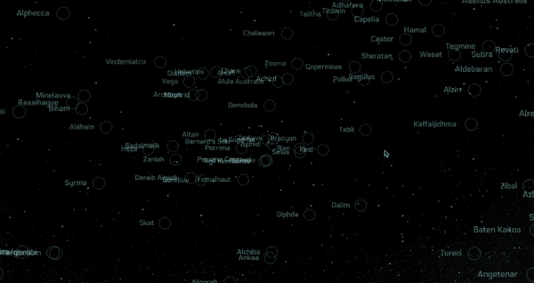

Like I mentioned last week, there won't be many tangible updates. A prerequisite for creating ships in the startup that can fly around is creating the systems for those ships, like engines. And a prerequisite for creating systems is creating the underlying plugin system for configuring and saving those systems. I've spent this week designing that system, and I'm pleased with how it's coming along. No other updates on that, but hopefully I'll have screenshots of the completed configuration screens next week.

However, I have been playing around with the starmap a bit. A big part of making the engine systems is deciding how fast they should go. But without knowing roughly how far we would be traveling during a mission, it was hard to pick a number. There's a balance to strike between having enough places to go, and making it feel like the universe is big and unknowable. There are also story considerations, such as making sure you can't just call for backup when you're in a tough spot.

To remove any ambiguity, I found a list of around 300 named stars that are close to Earth, calculated their position in space, and rendered them in the starmap.

As you can see, there are a lot more stars in close proximity to the center, where Earth is, so there will be plenty of places to travel without making it feel live the universe is too small.
