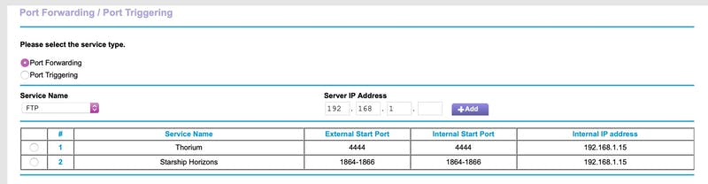

This essay is going to dive into some technical topics. I’ve written it in a way that anyone with a bit of computer knowledge should be able to understand the important concepts.

If you are going to play a multiplayer game across multiple computers, you are going to need to have some kind of networked communication between those computers. Typically this happens over a Local Area Network (LAN) or over the internet, although the mobile game Space Team famously supports multiplayer using Bluetooth.

Today, we’ll be focusing on two aspects of networking: How computers know where to send messages, how computers know what messages belong to what program, and what computers do when a message doesn’t make it where it needs to go. At the end, I’ll share what approach Thorium Nova will take.

### IP Networking

In modern networking, every computer on an individual network is assigned an IP address unique to that network. For a home network, these addresses look like “192.168.1.15”, where each of those numbers is from 0 to 255.

If I have the IP address of a computer on my network, my computer can send messages to it. Usually, when my computer sends messages, it includes its IP address, so the other computer can send messages back. This is what allows our computers to have a conversation.

Things get a little bit trickier once we leave our network. If our network is connected to the Internet, our Internet Service Provider (ISP), such as Comcast or Centurylink or AT&T, have their own network which our network is a part of. Our ISP assigns us our own IP address, which is the IP address we use when we browse the internet.

You can think of our home network IP address as being the mailing address of our home, and the ISP assigned IP address as being the Post Office address. All of the messages eventually make it to the post office, and then the messages for our home network computers are distributed where they need to go.

If you want to see your public IP address, you can use a service like [https://www.whatismyip.com](https://www.whatismyip.com). This is the address which is assigned to you by your ISP, not your home IP address. If you want to know the IP address which your computer uses, look up the network settings. You can check [this guide if you are on a Windows computer](https://support.microsoft.com/en-us/help/4026518/windows-10-find-your-ip-address), and [this guide if you are on a Mac](https://osxdaily.com/2010/11/21/find-ip-address-mac/). If you are on a Linux computer, you probably already know how to find your IP address.

You might think that it’s unsafe to give people your public IP address, since people might try to hack you. While that is always a possibility, remember that any time you connect to any service over the internet, you are giving them your public IP address. Otherwise, how would they know where to send messages to you? By default, your home network router is configured to only allow traffic which is in response to messages you’ve already sent. That means people with your public IP address won’t be able to access things inside your home network unless you specifically give them access. Think of it like giving away your home address. You wouldn’t want to shout it out to everyone; otherwise someone might try to burgle you. But you can give it to your close friends or people that you want to connect to your network.

You might also be wondering why you never have to type in an IP address when you are trying to access Google.com or nova.thoriumsim.com or some other website. There is a directory service for websites called DNS. It lets web domain owners link their domain to a set of IP addresses. You can read more about that in [this delightful comic](https://howdns.works/).

### Ports

80. 443. 465.

You might be wondering what these numbers mean. Would it surprise you to know that these are port numbers which you use literally every day?

Ports are numbers which computers use to identify which network messages are meant for which program running on the computer. When a program, let’s call it Webster, starts accepting network messages, it tells the computer “Send me all network messages for port 443”. Then, when a network message comes in on port 443, the computer knows to send that message to Webster.

This means that the computer that sends the network message needs to know what port to send it on. Otherwise, the receiving computer won’t know what to do with it, or it might send the message to the wrong program.

That’s why certain ports are designated for certain programs. For example, port 80 is for HTTP traffic and is used by web browsers when you visit websites; port 443 is used for secure HTTP, or HTTPS. Port 465 is used for email programs. There is actually a [huge list of port number assignments which you can browse](https://en.wikipedia.org/wiki/List_of_TCP_and_UDP_port_numbers).

So, when you visit https://google.com, your web browser automatically knows to use port 443, since you are communicating over HTTPS. If you want to use a specific port, you can do that by putting it after the domain (or IP address, as the case may be), like so: https://google.com:1337. Just remember, if the computer on the other end isn’t listening on that port, it won’t do anything.

The number itself doesn’t really matter, though. What does matter is that the sender and receiver are both using the same port.

### TCP/UDP

Networks can be a little janky. Sometimes messages don't make it to their intended destination. Sometimes one message arrives before another message. Sometimes [sharks literally bite undersea cables](https://www.wired.com/2014/08/shark-cable/).

Fortunately, we’ve taught computers how to handle these kinds of situations. When we want to guarantee that our messages get to their destination in the correct order, we use TCP. TCP works by having the sending computer verify that every message makes it to the destination before sending the next message. While this is horribly inefficient (and makes for some good jokes), it does guarantee that messages don’t get garbled, and is the basis for nearly all communications over the internet.

UDP, on the other hand, is more wild and carefree than TCP. With UDP, the receiver doesn’t even have to acknowledge that it wants to get messages from the sender; the sender can just send messages, as many and as fast as it wants. It doesn’t care if the message arrived or not; in fact, the receiver doesn’t even have to tell the sender whether it arrived or if it arrived in the right order. The sender just sends.

Why would you ever want to use UDP? If you are sending a message that needs to arrive as fast as possible, but if it doesn’t arrive it’ll be fine because another one will arrive right after it anyway. This describes pretty much every real time audio and video chat service. Who cares if you miss one frame of video? You’ll have a stutter for 1/30th of a second, and then the next frame will come and everything will be fine. No need to worry.

UDP is also often used for real time video games. Suppose we’re playing multiplayer StarCraft. We’re watching our units move across the map, and a single network message drops and doesn’t arrive. The game is programmed to handle these situations. It likely knows roughly where the units are moving, so it will pretend that it got the message and keep moving the units. Then, when it gets the next message, it will adjust where the units are going appropriately. If enough messages don’t make it, though, the game won’t have enough information to know what to do, and will start lagging.

There is a fascinating video about all the strategies video games can take when working with different networking situations. If you’re interested, [you should check it out](https://www.youtube.com/watch?v=Z9X4lysFr64&t=850s).

### Port Forwarding

Now that we know about IP addresses and ports, we can open up our home network to specific ports only. We do this by adjusting the Port Forwarding configuration of our home router (which is typically listed under advanced settings). We specify what port we want to allow in, and what computer in our network we want messages to that port to go to. Since we only have one public IP address, we can only have messages for a specific port go to a single computer (but if we were clever, we could program that computer to forward the message to any of the other computers in our network, but we won’t cover that today.)

So if I wanted to forward Thorium Classic traffic from outside my network to a computer running Thorium Classic, I would configure port 4444 (or whatever port you set Thorium Classic to use) to forward to the IP address of the computer running Thorium Classic. I could even configure it so any incoming traffic on port 80 is forwarded to port 4444, so I wouldn’t have to specify a port on my web browser. If I want to limit traffic even more, I can say that only TCP traffic on port 80 is allowed in, since Thorium Classic only works over TCP.

You’ll want to check with your router’s manual to see exactly how to configure port forwarding.

### The Trouble with Browsers

Web Browsers are really awesome. They allow us to access computers in all parts of the world and are continuously updated with new features and capabilities, making browser-based apps on-par with native apps in many cases. However, their ability to run arbitrary code from anywhere in the world makes them a juicy target for hackers and wicked people. Because of that, browsers have to be built with security in mind, which means many features will never be possible. That includes sending UDP messages.

Fortunately, there is a way around this problem. Browsers do send UDP messages - just look at video chat applications. These use a protocol called WebRTC, which creates peer-to-peer connections. That means my computer connects directly to your computer when we video chat, instead of going through a third-party server. WebRTC is able to send UDP messages, and the way it is implemented avoids the security dangers. For example, WebRTC requires an HTTPS connection to work.

### Thorium Nova’s Networking

Thorium Nova is largely going to replicate the networking stack of Thorium Classic. Almost everything will be done over regular TCP connections to a central server. Since Thorium Nova runs in a browser, using TCP is much easier and, as Thorium Classic proved, works well enough.

Thorium Nova is going to have a lot more real time data, though. The 3D viewscreen, the star map, sensors, the internal ship map, and a whole host of other features will require a steady stream of data. In addition, Thorium Nova is meant to be played over the internet. Over long distances, TCP messages take even longer to arrive, and can easily cause lag.

Thorium Nova will ship with a separate WebRTC-based networking layer. This will be a separate layer entirely from the normal networking stack that will allow speedy UDP messages for things like the 3D viewscreen. Remember, WebRTC requires an HTTPS connection, so if the server isn’t started using HTTPS, Thorium Nova will fall back on the TCP networking layer.

Securely running a server with HTTPS isn’t a simple thing, but the benefits will be obvious. When I have Thorium Nova in a place where I can demonstrate the difference between the two communication methods, I’ll be sure to post a comparison video.

---

And that’s that! The more I’ve learned about the internet and computer networking, the more surprised I am that it works at all. But it does work, and that’s what allows us to watch cat videos and run spaceship bridge simulations over the internet.
