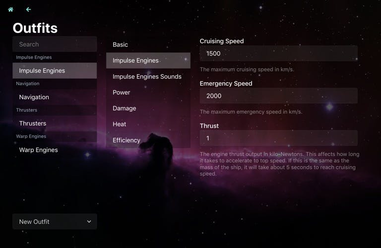

As I've said before, not much to report. I'm still working on configuring ships and engine systems.

I can show the Systems configuration screen. I know it says "Outfits" - I was toying with changing the name from "Ship Systems" to "Outfits", because I was getting confused. But let's be real, they're going to be called "Systems".

