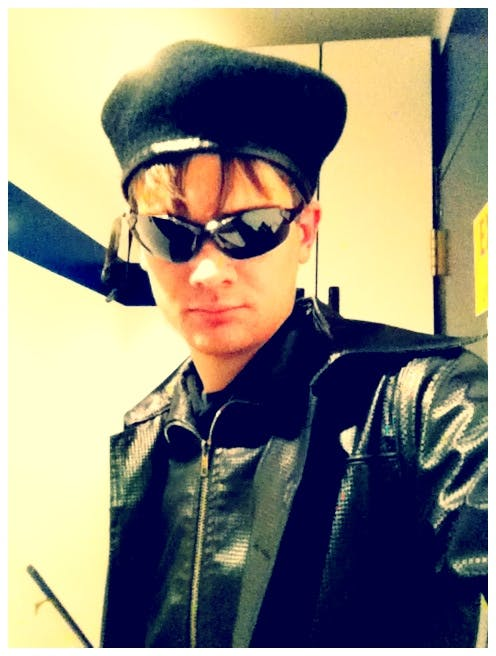

When I used to work at the Christa McAuliffe Space Center in Utah, it was during the Center’s golden age. In 2012 the Space Center was shut down for renovation and many of the most exciting offerings, like overnight camps, were permanently discontinued.

Before 2012, we had a blast. Most often we would run 5 hour missions with a break for bedtime halfway through. These missions all seemed to be written in such a way that there was a creepy, scary, or sneaky away mission through the halls of the Space Center during the nighttime section. The lights were all turned off and black sheets of fabric covered the security lights. Rotating red lights were the only source of light as the crew explored an alien ship or a long-abandoned planetary base.
We were able to tap a rich volunteer community for actors that would come and play parts during these missions. Some were mad scientists; others were disgraced princes. My personal favorite acting part was the rogue anti-hero, determined to do the right thing while making a buck at the same time.

And of course, no space adventure would be complete without an attack from a space monster. Staff members would don a mess of rags and a frightening rubber mask and chase the crew through the hallways screaming incoherently. Or, if the goal was to be more subtle, the Flight Director might thump on the walls of the simulator while making ominous noises over the microphone.

They looked awfully similar to this monstrosity

During the summer, we had even more leeway. During some camps, the campers would stay at the Space Center for three days at a time doing rotations through the ships, with a different mission on each rotation - no continuous storylines though. By necessity, these camps always included a trip to the local swimming pool on the second day. so the campers could at very least get a shower. Then we would play a classic science fiction movie and send the kids to bed.

Our Leadership Camps always took it one step further. Instead of separate missions for every rotation, all of the ships would be part of a shared campaign mission, where the decisions of the previous rotation would affect the next. The entire camp centered around an overarching goal and the crews had to work together to accomplish it. We reserved these camps for only the oldest of our eligible age groups.

We still took the campers on a swimming trip, but instead of a nice, calm movie night, the crews returned only to be thrown back into the action. The entire Space Center was covered in lights, decorations, and obstacles. The crew was told they had an objective to complete - find some data disk, or take back prisoners. During one camp, the entire crew of one of the ships was taken hostage during the rotation right before swimming, so we separated those campers from the rest of the group and had everyone else try to find and rescue them. The crews had to be careful and cunning to avoid enemy detection, get the equipment they needed, and find their objective.

One of my favorite parts of the entire camp was the situation room at the very end. The mission was an all-out assault on the enemy battleship. All five simulators were participating. We pulled the Executive Officers of each ship away so they could plan and strategize in the situation room while the rest of their crews executed their plans. We created vast and detailed maps of the environment and gave them a series of targets they needed to find and eliminate. Small dots and figurines were used to mark the positions of the crew ships and their targets. Frequent communiques arrived from our staff giving the XOs more information, while the XOs sent messages back to their respective ships with orders and details. We called this rotation “Mass Chaos” - an apt title.

While the Leadership Camps may be the end-all-be-all of Space Center camps, there is a special place in my heart for the 17 hour camps. These camps started at 5:00pm and ran until 10:00pm the next day. The only simulator that ran was the Voyager, since it was the only simulator of the five with a built in galley, bathroom, and crew quarters. That’s right, other than away missions, the crew would stay on the ship in-character for the entire 17 hours.

The staff even registered them at the beginning of the camp in character, and stayed in character for the duration of the camp. Mine was Lt. Commander Raphael Mancini, a marine assigned to work with the Delta Force squad that was included in the bridge crew. Being in character meant I could check in on the 18 crew members to make sure they were having a good time and were still engaged in the mission.

I might have overdone it with the costume

Since this was the only camp that ever ran on those nights, we had access to all of the ships and rooms in the Center. We would send Delta Force off on covert missions using the Galileo shuttlecraft (an actual shuttle that lived in the cafeteria); once they had to capture and pilot a pirate ship (one of the other simulators that I created custom pirate controls for).

My favorite of all time was when the crew managed to crash-land on an alien planet inhabited by a pre-warp civilization - about the same level of technology as Earth in the 21st century. The crew needed parts to get their ship repaired, and their supply of water was running low. We split the group in two. Half of them were to go get a sample of water; the other half needed to find a local scientist and convince him to give us the necessary parts to repair our ship.

Everyone was given costumes “matching” what the local population wore (they did not, and the crew looked ridiculous), and the group getting the water sample was given an approximation of local currency. We then set out into the world!

In reality, we ended up taking the crew on a stroll through Pleasant Grove, Utah. The water sample group went to a local convenience store for bottled water. We told them the universal translator was broken, so they couldn’t say anything or it would freak the locals out. We just told them to get a receptacle (bottle) of water, smile broadly at the store clerk, and give them the currency. And so they did. I am told it was hilarious.

I was with the group going to find the scientist. One of the Space Center staff lived close to the Space Center and offered to dress up his home to look more like a mad scientist’s lab. The effect was quite good. Unfortunately, we got a little lost and when we tried to ask for directions, the local we asked was quite perturbed, which only played into our narrative more.

In the end, the crew succeeded and managed to find their way home.

---

I share all of this because these simulations are more than just the controls. Yes, the controls give us a framework and pretty visuals to show on the viewscreen. But there is a lot more that Flight Directors can do to make a good simulation than just plopping the crew in front of a set of computers and pushing the “Go” button. Oftentimes, the most memorable parts of the mission happen away from the controls altogether!

Sometimes it takes a bit of planning and preparations, like with the situation room during the Leadership Camp. Other times, you can give the crew tasks on a whim, like getting a water sample from the local convenience store.

The point is that we don’t have to confine our simulations to single rooms or booths at a con. There are many ways to enrich the experience for crews without them even needing to be on a bridge.

How would you expand the mission experience beyond the bridge simulator controls?
