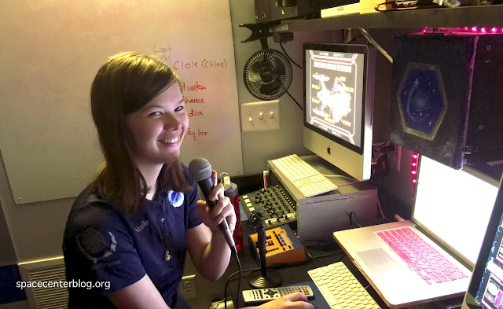

I'm trying something new this week - an interview with a Flight Director. Natalie Anderson is a Flight Director for the Christa McAuliffe Space Center. She's also an author, and has a mystery novel coming out this spring. You can find out more about her on her website, https://nataliebrianne.com. She joined me this week to talk about what being a Flight Director means to her.

Are you a Flight Director or bridge simulator game master? Let me know if you want to be interviewed for a future newsletter feature.

**Alex:** How long have you been a flight director?

**Natalie:** I have been a flight director for 6 years.

**A:** What is it like to be a flight director?

**N:** Well, a flight director is like going to a play, but where you are one of the actors, and the Flight Director is the person behind the scenes doing the lights, the sounds, playing all of the supporting characters, and basically everything that needs to be done to run the show other than being the lead actors.

So I’m behind the scenes; I sit in a small box with a microphone and a whole bunch of computers that do all the visuals and sounds. I have cameras to see what everyone is doing on the bridge, and I help to orient the story and tell the story in the best way possible, catered to the individual crews.

**A:** What makes a good flight director.

**N:** They need to be flexible. They need to focus on the crew and adjust their methods to help each crew member. It helps to have a good repertoire of different voice accents to play the different parts. Having an understanding of music theory can help to properly set the mood - that’s a great storytelling method. It’s really just being a good storyteller.

And in many ways a good educator. I’m an advocate for teaching meaningful skills and teaching ideas through flights, and I think that’s one of the best perks of being a flight director.

**A:** Tell me about the characters you play during the flight.

**N:** There are a bunch of characters you play during the flight. The two I use during every flight are the Main Computer and a “Deck 2” character of some kind. In my main ship, the USS Odyssey, we call this character the Computer Specialist.

Both the Main Computer and the Computer Specialist are options that the crew has for help, but the computer specialist is much more personable. There’s a kind of camaraderie that happens between the crew and the flight director through this character.

Depending on the mission, there could be other characters that you play. You could have allies that come in to play. You could have bad guys. You could have a random border patrol officer that annoys them, or other random characters.

I once looked at it and discovered that I had a mission where I had to do 10 different voices. And a voice changer hooked up to a microphone only has so many settings, so you have to learn how to change your own voice in different ways.

My computer specialist is named Clover; she has a kind of Scottish/Irish hybrid voice. I’ve practiced it a lot, so that voice flows easier.

**A:** Tell me about your favorite mission.

**N:** My favorite type of mission is an extended camp. It’s a 10.5 hour long mission, we’re in character the whole time. Any meals, any bathroom breaks that the crew takes, anything that happens, the staff is in character. The only time staff break character is when they aren’t in view of the crew.

For about 10 hours, I’m playing my computer specialist in person, all dressed up. So I get to have more camaraderie with the crew. And it’s really fun. The crew really gets into it. They immerse themselves fully in this space. And because we have so much time, we’re able to really flesh out a story and get to know the characters.

If we’re talking about a specific mission, it’s Plight of Thieves, which is one of our 5 hour missions. It’s a staple of my ship. It’s about different factions of pirates all vying for power. It’s has a lighthearted tone, but also a dark underbelly that the crew can pick up on if they are smart and pay attention.

There’s a character that’s with the crew along the way - a wannabe pirate that’s not very good at piracy. Think of this character like Jack Sparrow mixed with Guybrush Threepwood, but more incompetent. Sometimes the crews really trust this character, and sometimes they don’t. But strong characters like that really make the story more engaging and interesting for the crews.

**A:** Tell me about working with your simulator controls.

**N:** The controls are definitely a means to an end with the experience. I don’t think you can have a good experience without the controls. I have a metaphor, where the controls are paper and pencil in drawing. You need paper and pencil to draw, but they aren’t necessarily your favorite part of the drawing experience. I can tell the difference between good and bad paper, but only because it’s a means to my drawing experience.

Thorium is like paper. You need to have it in order to fly. And I would say Thorium is higher quality paper than most that I’ve used. Thorium is sleek shiny paper for flying. (My metaphor is breaking down. _laugher_)

Also, it’s necessary to have a set with the way I’m accustomed to flying. I think it’s possible to fly without a set, but it would require a change in my thought process to do properly.

**A:** Tell me about working with the staff and crew.

**N:** We have a lot of fun. In the Odyssey, we have one flight director, but we also have one to three volunteers that we work with, depending on the length of the flight. We do write up characters for our volunteers to play where they interact with the crew in-person, which is so much fun.

It’s lots of fun to see these junior high/high school age volunteers take these characters and give them their own spin on things and their own personality. Sometimes this goes awry, which is okay - everyone is learning. But sometimes they do something really special, which is lots of fun to watch.

Sometimes we’ll do joint flights with multiple simulators working together. We have to be creative together to come up with interesting ideas to get the crews to work together. And when you write new missions, where all the flight directors come together to write a new summer story with a box of pizza and a whiteboard, those are some of my best memories.

Working with my crews is my favorite thing. Technically you have the same mission that you do over and over again, but for different crews. The crews add this spontaneity - I have no idea what they are going to do. Sometimes that’s a good thing; other times it’s not. A mark of a good flight director is to go along with their ideas and not shoot it down.

Some of my favorite crews are the ones that think outside the box. We have some crews that keep coming back that are our favorite crews. We give them nicknames because we love them so much. We have a special channel in Discord where we write “Memorable Crew Quotes”. And after work, we’ll sit in the parking lot and tell stories about the crews that we love. And of course, we have crews that add to those stories that we tell.

**A:** Anything else you want to share?

**N:** Flight Directors open a gateway to new worlds, cultures, and scenarios and help to foster the imagination of the crew, taking them to new heights, while exploring the shortcomings of our current society. It’s a dream job, it’s fun, but it is also incredibly fulfilling.
