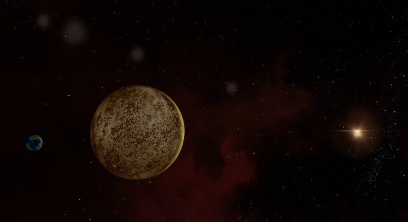

This week has shown massive progress. The 3D viewscreen is now rendering objects from our startup. Here's a little shot that I set up of a moon, its planet, and the star. Notice the JJ Abrams style lens flare. 🤩

My purpose for building the 3D Viewscreen right now was so I could put a ship in it to test out my auto rotation. Not only did I get the ship rendered, but I also got auto-rotation working correctly! The ship is configured to turn and point somewhere above the star, and you can see it automatically reorient itself.

There's a lot of tweaking to do to make it work well, but overall I'm pleased with the outcome. I've also confirmed that the lateral thruster movements and impulse engines are working correctly, so I should be able to get this ship moving around to any point in space.
