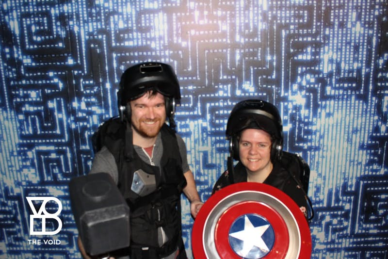
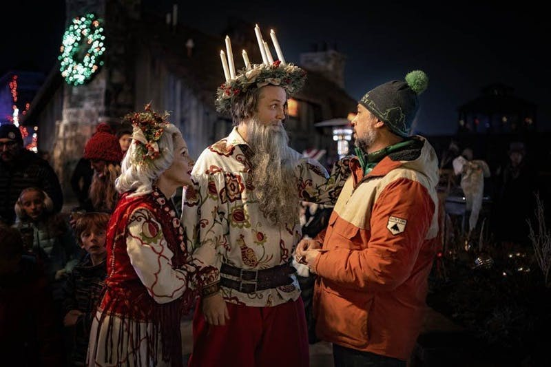
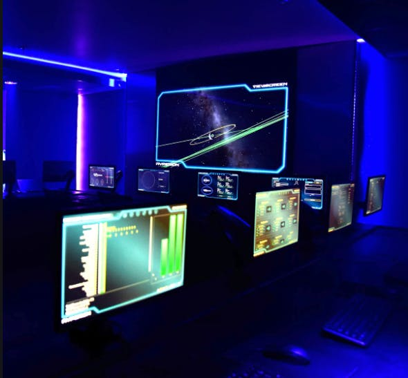

Ken Bretschneider is living his best life.

In 2012, after becoming flush with cash with the success of his website security company Digicert, he decided to fulfill his childhood dream and create an immersive live-action role play park in the middle of Pleasant Grove Utah. He called his creation Evermore, and began planning the park using 3D video game software.

As plans were being made, he and his team realized that by combining their 3D environment with VR and a physical set, they could theoretically walk around their made-up world in real life. While they waited for the appropriate zoning ordinances to pass in the city, they shifted gears to create their physical/virtual hybrid project called The VOID.

In The VOID, participants in small groups are given a VR headset attached to a backpack, allowing them to be mobile as they move through the physical set. In real life, this set looks like a bunch of plywood boards painted a muted color, but through the VR lenses, you see rich environments that you can literally walk through. Overhead cameras detect the position of each participant using markers on the top and shoulders of the VR apparatus. Props, like blasters in the Star Wars game or torches in the Jumanji game, also have trackers, allowing the participants to pick them up and use them.

Last year, Crystal and I went to the VOID in Las Vegas. I had done some of their beta experiences back in Lindon, Utah. Crystal had never done any kind of VR experience, so she was apprehensive.

Seems appropriate that I wielded Thor's hammer.

We did the Avengers experience, and were tasked with testing some new Iron Man suits. We got to shoot robots with our laser hands; we visited the locations from the films, like Wakanda, the Bleeker Street home of Dr. Strange, and upstate New York Avengers compound; we saw real-life Avengers, like Ant Man and Falcon. The VR tech looked great, and everything looked and sounded spectacular.

And we kinda felt like we made a difference. But the whole thing was on rails. We had no choice but to move from one place to another to advance the storyline and didn’t even have the illusion of choice. If we took a wrong step, the invisible staff member that was guiding us would gently nudge us back on track. Even if we didn’t shoot down any of the bad guys, we still would have won. There was no consequence, no investment, and no emotional connection.

Contrast that with Evermore, which opened in 2018. The park only has one ride, a small train that travels around the park. Instead, the main attraction is the many characters that live in the fantasy world within the park. Guests are encouraged to engage with the live-action role playing and interact with the inhabitants, ask them questions, discover their backstory, and maybe be sent on a quest. Several guilds are represented in the park, and guests have the opportunity to join any one of them. But none of this is required. Guests could choose to blend in and enjoy the ambiance.

Just a few of the colorful characters you can meet at Evermore.

There is no guide, no staff member pushing the guests to do anything. It’s entirely up to them, and they’ll get back whatever they choose to put into their experience. In other words, to have maximum enjoyment, guests need to be emotionally invested. They have to care about what is happening around them.

There is one thing The VOID has that would be difficult to replicate in Evermore: Conflict. In Evermore, the story is the individual characters and the various tasks they have guests perform, but there’s no stakes, no rising action, no climax. Just a pleasant evening of wonder.

Thorium (and Thorium Nova) spans the gap between rote storylines and dynamic live-action experiences. Crew’s aren’t expected to sit back and enjoy the show - they could go to a movie for that. And crews shouldn’t expect to only fly around space and shoot each other - there are plenty of video games that can give them that experience.

No, we expect - even demand - that crews get into character and connect with the story. A good Flight Director weaves the storyline around the actions of the crew, helping them feel that they truly are making a difference and that their choices have real consequences. We want them to feel invested in what is going on and what they are trying to accomplish.

Through the Flight Director (and any other actors that work with the Flight Director) the crew can interact with as many characters as can be imagined - greedy merchants; bloodthirsty warlords; suspicious xenophobes; disgruntled pirates. All of these add flavor and interest to the mission.

The USS Hyperion simulator in Orem, Utah running Thorium Classic

Each crew member has a different job, which means each gets a different experience. While the captain is focused on negotiating with the Pirate ambassador, the security officer is dealing with misplaced explosive grenades; meanwhile Communications is deciphering intercepted messages that show not everything is as it seems. The mission experience is like a jigsaw puzzle; only by sharing all the pieces can the crew begin to see the entire picture.

That also means each crew member has a different story to share. Their experiences last far beyond the time they spend on their ship. The mission storyline, the characters, the action and excitement, and the experiences will continue for months, even years to come.

But that only happens if the crew is invested - if they care about doing their job well; if they are motivated to accomplish their mission objectives; and if they are fully engaged in what is happening around them. This isn’t the “sit back and relax” experience of watching a movie, and it isn’t the railed adventure of The Void. It’s more like Evermore, where the action only continues if the crew immerses themselves in the experience.

Every person I know who is passionate about starship bridge simulators caught the bug from experiencing a bridge simulation. These are the kinds of experiences that stick with us forever. Sure we could add more fancy VR tech like The VOID; or we could create a magnificent multi-acre set detailed with realism down to the last blade of grass. But I think all that’s needed is an adventurous crew, a capable flight director, and a compelling story. From there, a magical experience will emerge.
