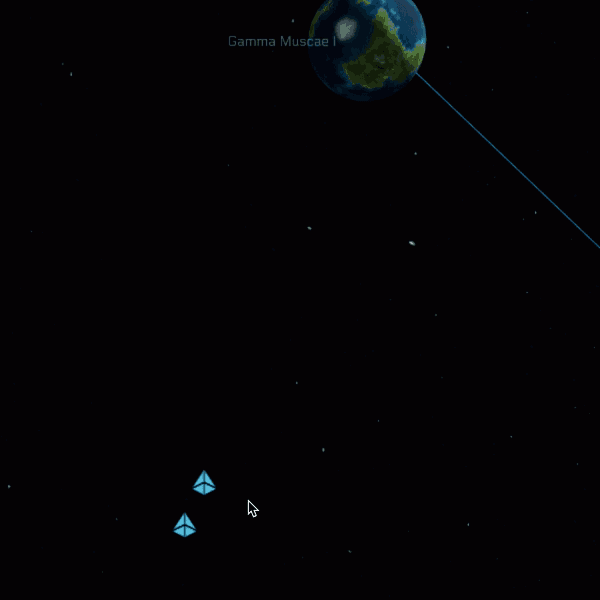

I've already done a lot of work on the Flight Director Star Map core screen. This is where the Flight Director will be able to view everything happening in the star map, spawn and remove ships, and give orders to NPCs.

As I explain in the essay this week, I want the Flight Director's experience to be seamless, smooth, and intuitive. I've made it so you can zoom in and out with the mouse wheel, and you'll zoom in based on where the mouse cursor is positioned, making it easy to focus on even the smallest ships in deep space. Also, you might notice that the Star Map features icons to represent the ships, stars, and planets at distance zoom levels. Once you get close enough, the icon is replaced by whatever the crew sees on the viewscreen.

Using the right mouse button, you can drag-select to choose ships on the Star Map. This should make it easy to give orders to large fleets of ships at once. This does make it feel very much like a real-time strategy game, like StarCraft.
