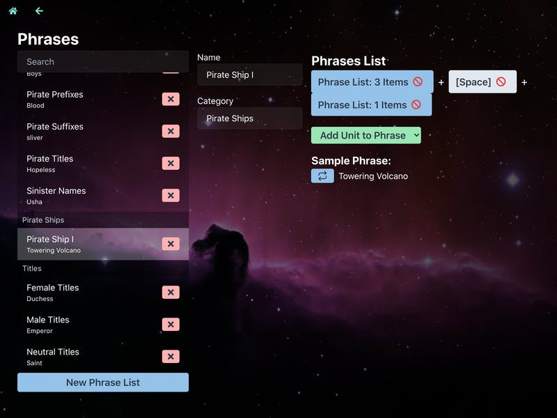
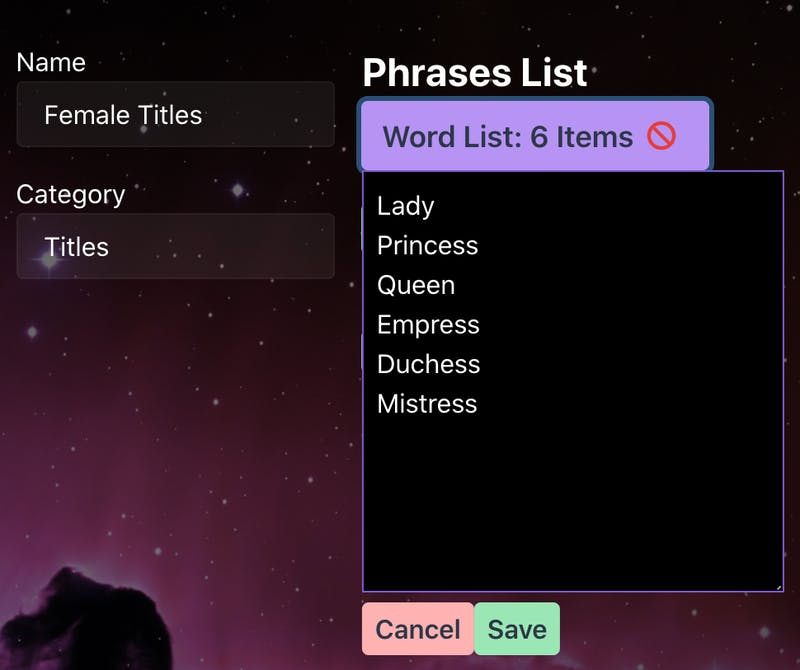
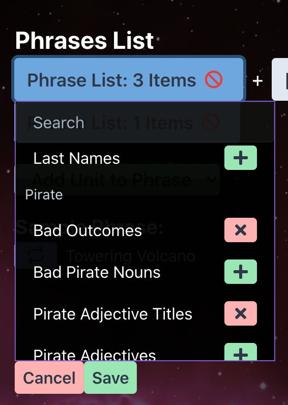

This week’s essay is a bit of a self-reflection, and perhaps second-guessing, on my goals for Thorium Nova. Sometimes, I build something thinking it’s going to be valuable to the community at large, but it ends up being over complicated and not useful to anyone. Specifically, I’m thinking about end-user configuration.

This week I took a slight detour to work on a feature that I knew I would need eventually. Based on the excellent phrase engine included in the game Endless Sky (https://endless-sky.github.io), it works sort of like Mad Libs. You can create lists of words (or entire strings of text), such as nouns, verbs, adjectives, etc. and compose them together to create a randomized phrase. This is used in Endless Sky to generate random ship names and some of the dialogue in the game.

As an example, suppose you had a list of singular nouns, like “Echo”, “Fortune”, and “Dream”; and a list of, for lack of a better term, things you can be “of”, like “of Fate”, “of Glory”, or “of the Deep”. Compose these two word lists together and you get some not bad-sounding ship names, like _Echo of Fate_, _Fortune of the Deep_, and _Dream of Glory_.

What’s more, you could compose these phrases with other phrases to create more complicated sentences. This could be the basis of a very nuanced and dynamic communications system with NPC ships when there is no Flight Director present. If you want, you should check out [this link](https://github.com/endless-sky/endless-sky/blob/master/data/human/hails.txt) which shows how Endless Sky does just that to create small talk when you hail other ships.

I built out this phrase system this week, and it works great. You can create your word lists, compose them into phrases, compose those phrases into more complicated phrases, and then feed it into a parser which gives you a single, coherent, randomized string - exactly as I might expect. The only problem is the complexity for the end user creating these compositions. How would you even represent all of this in a user interface?

Endless Sky doesn’t have any kind of user interface for creating these phrase compositions. Instead, like you saw in that link above, everything happens in a text document. This is effective, but might be a little complicated for beginners to pick up. Instead, I decided I would try to build out a UI for generating phrases. Here’s what it looks like.

On the left side of the screen you can see the list of all of the phrases that have been created so far. Each of these has either a list of words or a combination of words and other phrases. On the right side of the screen is where you create these combinations. You can click the “Add Unit” button to add either a word list segment or a phrase list segment. If you add a word list unit, you populate it by filling in the text box, with each line representing one possible string of text to be included in the final phrase.

Phrase list units let you choose from the existing phrases (that giant list on the left). You can choose multiple phrase lists, and one will be chosen at random when the entire phrase is parsed.

Then, underneath, you can see how your phrase will turn out when you parse it.

A few downsides: Inserting single words into a phrase isn’t straightforward. You have to create a word list unit and put your single word in that. Also, you currently can’t weight one phrase higher than another to make it appear more frequently (although that could be added later on).

It isn’t perfect, but it works. The question is - is it good enough, or is it too confusing? Does it meet the needs of Thorium Nova’s userbase? And most importantly, is it friendly and intuitive so people feel comfortable using this feature? Does this even need to be configured, or should I ship Thorium Nova with an unchanging set of possible ship names?

---

Crystal and I spent some time this week outlining the possible users of Thorium Nova and narrowed it down to three groups:

- Casual gamers that just want to sit down and play it; they likely will install plugins made by other users, but won’t create their own or modify existing plugins.
- Hard-core Game Masters; these folks have their own crew that they regularly fly with. They’ll create new content and missions for Thorium Nova to individually cater to their bridge crew. I imagine most of them will operate within the default Thorium Universe and lore, so they won’t configure every aspect of the simulations.
- Brick-and-mortar space centers and commercial LARP ventures; naturally, these groups will need the most configuration options, since they might do a complete overhaul of the Thorium universe to better match their purposes.

Where does this random ship name generator fall among those potential users? Will the Game Masters want to modify ship names? Or will they be content using the names that ship with Thorium Nova?

What if Thorium Nova were to adopt an approach like Endless Sky, where these randomized phrases are based on text documents? This is less user friendly than the UI I created, but it might work better for “power users”.

In short, I’m trying to figure out where to draw the line with “power user” features and features that should be accessible to every user. I would love your thoughts on this. Here are a few questions that sum up the above.

- Did you understand my explanation of the random phrase generator system and UI I described above? How would you change it to make it more intuitive while maintaining its functionality?
- Where do you see yourself on the Casual Gamer -> Game Master -> Commercial User? What kinds of configuration options do you want to see? What kinds of configuration options aren’t important to you?
- Imagine you were creating an automated system which would facilitate crew communications with NPCs, such as planetary bases, ships, and starbases. This system should work without a Flight Director. How would you want something like that to work?
