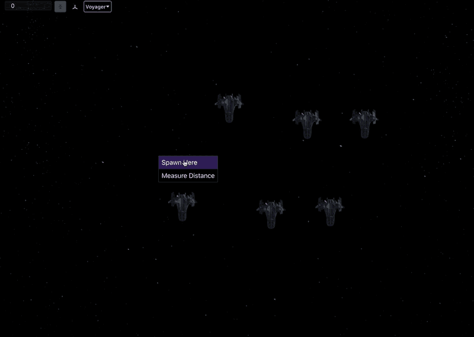

This week I continued building out the Flight Director star map. They can now select contacts (ships) and right-click to give them move orders. They can also click and drag contacts to either give them a move order or instantly move them to a location in space. I also got ship spawning working. When there are no ships selected, you can right click to spawn a ship at that location in space. You have to pick which ship template you want to use beforehand, but this makes it easy to spawn several ships in a short period of time.

I also worked on factions a little bit. Factions will define a lot of aspects of the ships, such as how they react to the player, who they choose to attack or defend, and what they might say if the crew sends them a message.
