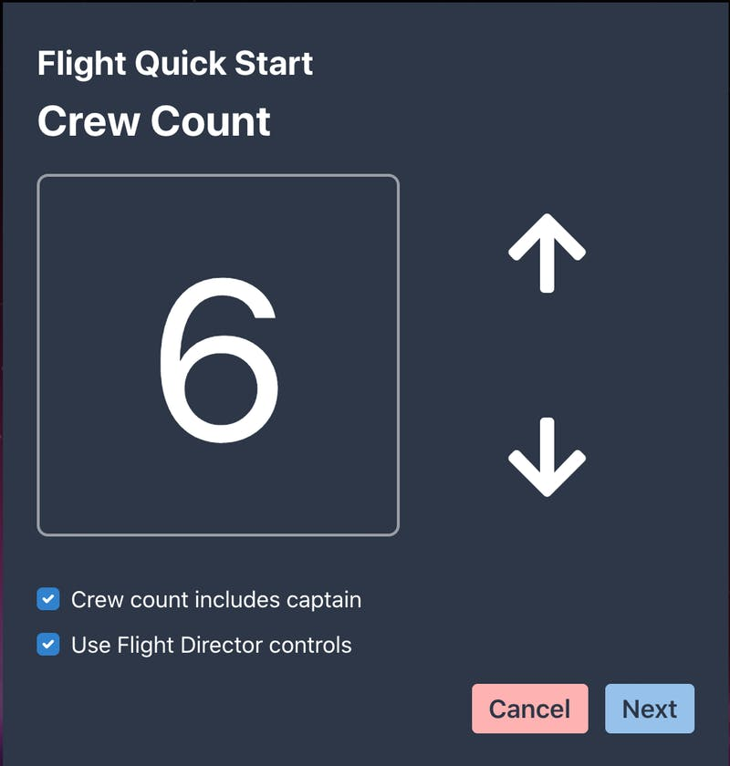
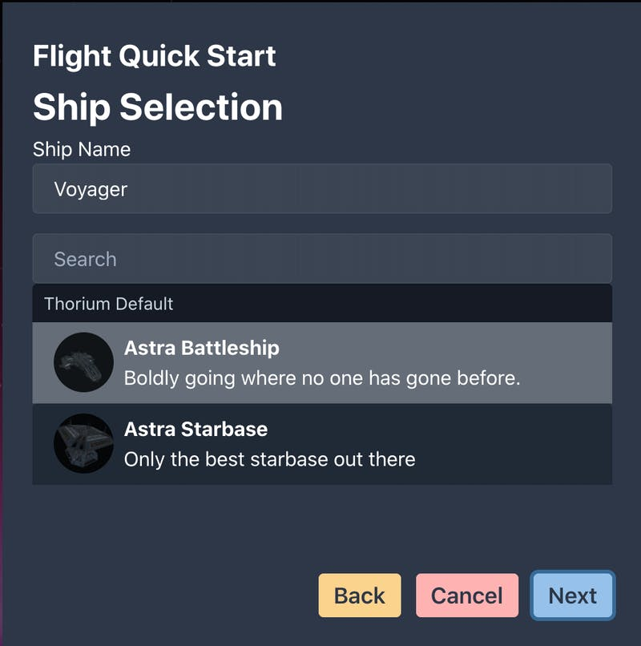
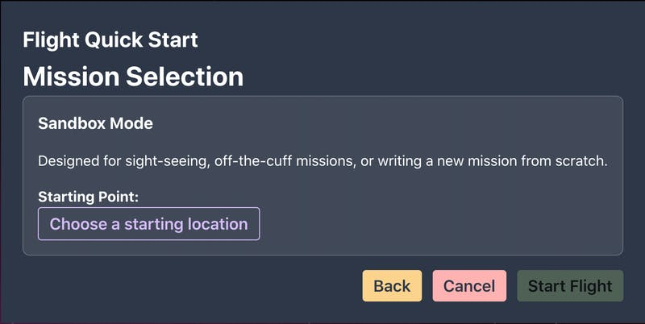
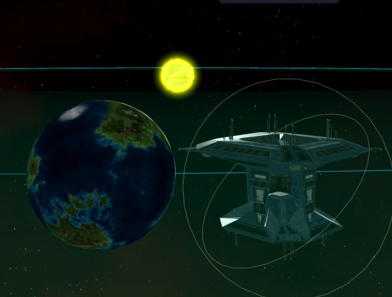
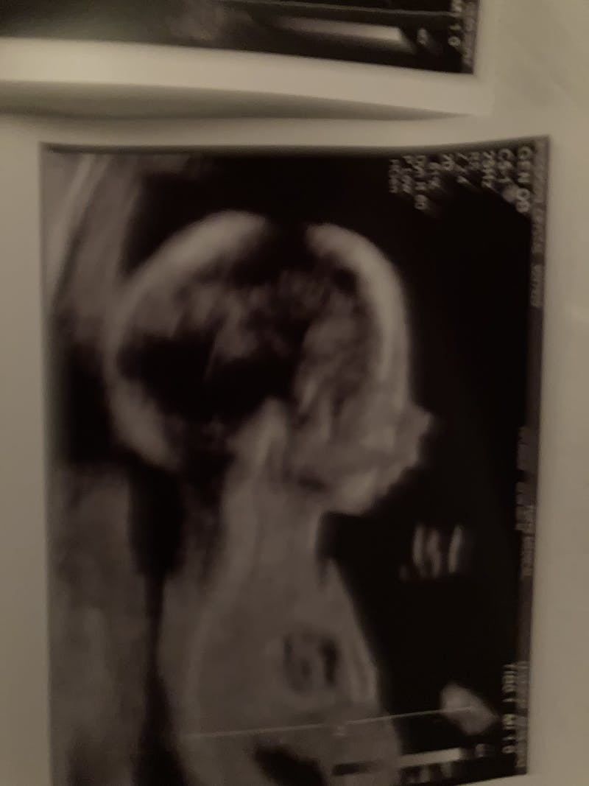

I've decided that I'm going to be building out crew controls for moving the player ship around. That means I need to finish up flight creation process and make it so you can assign a simulator to a flight.

Since I wanted to make this process as smooth and straightforward as possible, I'm opting for a 'Quick Start' option, which walks you through a simple flow of getting a flight started. First you choose how many crew will be piloting the ship. This will automatically generate a set of stations (or crew positions) and assign the appropriate cards (these are the control screens on each station) based on which systems are on the crew's ship.

This configuration, with 6 crew which includes a captain would give us the following stations: Captain, Sensors, Operations, Flight Control, Tactical, Engineer. Fewer crew would consolidate controls; more crew would expand the control count.

Once you have chosen your crew count, you can pick a ship. The ships will be filtered based on the crew count, so you don't have crew members with nothing to do if the count is too high, or crew members with too many responsibilities.

Notice we have to assign a ship name that's different from the name of the ship template we selected. This is because the template is used to create many versions of the same ship. Don't worry - it remembers whatever settings you choose so if you always use the same ship template in your flights, you'll only have to set it up the first time you start a flight.

Thorium Nova is going to support multiple player ships in the same flight, but I don't think that will be common, so you can only configure one simulator using quick-start. For multi-bridge flights, you can either use the more complicated flight configuration screen, or do quick-start, and then spawn a new player ship for however many bridges you have.

Once we've chosen a ship, we can choose a mission. Again, the missions will be filtered based on the capabilities of the ship that was chosen, so you don't accidentally send a ship with no Stealth Field system on a mission where the Stealth Field is necessary.

I haven't built out the mission system at all, so the only option is "Sandbox Mode". In this mode, there's only your player's ship, and whatever stars and planets you've added to the persistent universe. You just have to choose a starting location for your ship - specifically a planet or starbase that has been included in the universe. The player ship will be spawned a short ways away from the object that you added.

Oh, speaking of which, you can now add starbases to the persistent universe using the universe editor.

I've also been working on some super top-secret features that I think you're really going to like - but it's still way too early to announce anything.

#### One More Thing

Crystal and I would like to announce that a smol human is coming to live with us in April. Her name is Daisy.

