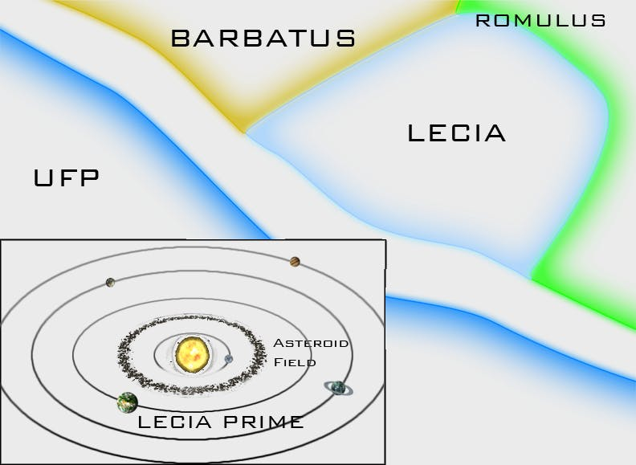

This post is the first in a series that describes a complete 5 hour mission that I wrote when I worked at the [Christa McAuliffe Space Center](https://spacecenter.alpineschools.org/). This essay will have the mission briefing; over the next few weeks I’ll give an in-depth explanation for how the mission was run. Also, note that the mission is set in the Star Trek universe - Thorium Nova is [getting its own universe and lore](/blog/Thorium-Nova's-Lore), so if I do include this mission in Nova, it will be adapted. This briefing is told in the second-person, as if you were the captain of the ship going on this mission. Enjoy!

### Stormfront: Mission Briefing

You, Captain, are a member of Starfleet, the military and exploratory arm of the Federation. We believe in peace, prosperity, freedom and democracy! Over 300 planets and worlds have willingly joined the Federation in the hopes of exploring the universe and creating a better, safer galaxy for everyone.

The Romulan Star Empire was the most ruthless enemy of the Federation. Romulans are sneaky, sly, and suspicious, and have no moral qualms with enslaving their neighbors. Dozens of planets have been under Romulan subjugation for decades, with little hope of relief.

The Federation would attempt to intervene, but crossing the Neutral Zone that separates Romulan and Federation space is an act of war, one which the Federation isn’t prepared to commit to. Sadly, we watched from the sidelines as the Romulans enslaved intelligent lifeforms.

However, three years ago, a highly volatile supernova ripped through the Romulan homeworld, destroying it in an instant. (See the 2009 Star Trek movie for more information). The seat of Romulan rule was destroyed, along with any hope for the Empire to remain intact. Enslaved worlds throughout the Empire took their chance and seized whatever warships they could, thus bringing an end to the shackles of bondage.

The dissolution of the Romulan Star Empire was the most influential event to occur since the Borg War. Where one nation stood, 15 have taken its place. The more central worlds in the Empire have coalesced to create a new Romulan Union. Most of the former vassals to the Empire are not interested in diplomatic ties with either the Romulan Union or the Federation - they just want to be left alone for the moment. However, one of them, called Lecia, has requested membership in the Federation.

Lecia is the smallest of the former imperial states, and was most recently subjugated by the Romulans. Some Lecians can remember life before Romulan rule. Lecia’s territory is a single light-year across, bordering the former neutral zone, with the Lecia system at the center. The Lecia system also houses one of the old Empire’s largest dilithium mines, making Lecia somewhat wealthy now that they are independent. For many years, it was a troubled system, but having solved its domestic problems, it has been deemed worthy of Federation membership.

In preparation for Lecia’s entrance into Federation membership, Earth has dispatched an ambassador via the USS Lexington to execute the final formalities such as the final review of the Lecian constitution and setting a date for official admittance. This will all take place in the grand hall of the Lecian capitol building. The Lexington crew will be very busy providing security on the planet and hosting a few VIP representatives of Lecia on board. Therefore captain, **your ship** is assigned to watch the planet and the star system for any signs of trouble while the talks are taking place.

Starfleet has a good reason to be worried about security during this mission. For one thing, this will be the first time any Federation ship has entered the former neutral zone. It’s possible that Romulans might try to seize that space and attack any ships that enter. We want the Lexington to have an armed escort as it travels through the contested area of space, just in case.

Lecia has also ruffled a few feathers by applying for Federation membership. The Romulan Union is very upset. Lecia, a former member of the Romulan Union, joining the Federation means a Federation presence in the Romulan’s former sphere of influence and a potent dilithium mine in Federation hands, not to mention a wound in the Romulan’s pride. What’s more, many Lecians are opposed to joining the Federation. A political party, known as the Loyalist Party, has been campaigning against it. They support rejoining Romulan Union instead.

Captain General Cornelius Lucius, head of the Lecian military, is rumored to sympathize with this party. Lucius is officially and historically a member of the president’s party. Any chance that he is a Loyalist could be a problem. If possible, **your ship** should keep an eye on him. As mentioned, the other countries that surround Lecia aren’t interested in diplomatic ties with the Federation. Barbatus, for example, has warned us that they regularly patrol their borders and will treat any incursion as an act of hostility. Obviously, it would be a bad idea to travel into Romulan space, so make sure you only go to Lecia.

The Lexington will be handling all of the negotiations, so your mission is simple:

- Escort the USS Lexington across the Romulan Neutral Zone to the planet Lecia Prime.
- Maintain security during the negotiations between the Federation ambassadors and the Lecian government.
- Investigate any rumors of Captain General Lucius and his staff.

Good luck, Captain!

---

I want to point out a few things in this briefing.

First, think of the briefing as the first chapter of a book. In many cases, this might be the very first time the crew ever interacts with your universe, so they need to know who the characters are and what the setting is. Even if your crew is familiar with your universe, they need to know where different factions stand right now. In some missions, the Romulans are friendly, and the crew should know if the Romulans are on their side or not during the briefing.

The briefing should give enough information so they know the backstory without wasting time or attention. We could go into all of the geo-political effects which brought the Romulan Union to its current position, but that would be unnecessary fluff. All the crew needs to know is that the Romulans are bad, Lecia is good, and Captain General Lucius is an unknown.

Don’t forget [Chekov’s Gun](https://en.wikipedia.org/wiki/Chekhov's_gun) either. This is the principle where if the author specifically mentions a gun hanging on the wall in chapter 1, it will probably have some importance later on. Here, I briefly, but specifically, mention the country of Barbatus, which plays an important role later on during the mission. Also mentioned directly is the asteroid field, which is the only other thing labeled in the solar system map other than Lecia Prime.

These might seem like overt hints, but we need to remember that the crew doesn’t have a script. There is no way for crews to know what the “correct” path to go is. By giving them these hints, they are able to piece together what the correct answer is on their own, rather than relying on their best guesses or even more overt hints from the Flight Director later on. It’s also good to give a bit of misdirection as well. For example, this briefing strongly warns about problems as the crew crosses the Neutral Zone. Those never come to fruition during the mission, but giving them that red herring makes them less likely to be suspicious when the real conflict of the story begins.

Finally, at the end of the briefing, give very clear mission objectives. Make sure the crew knows that those are the only things they need to worry about so they don’t get distracted with anything unnecessary.

Hopefully this gives an idea for how mission briefings should be in Thorium Nova. Tune in next week to catch part 1 of the mission: Stormfront.
