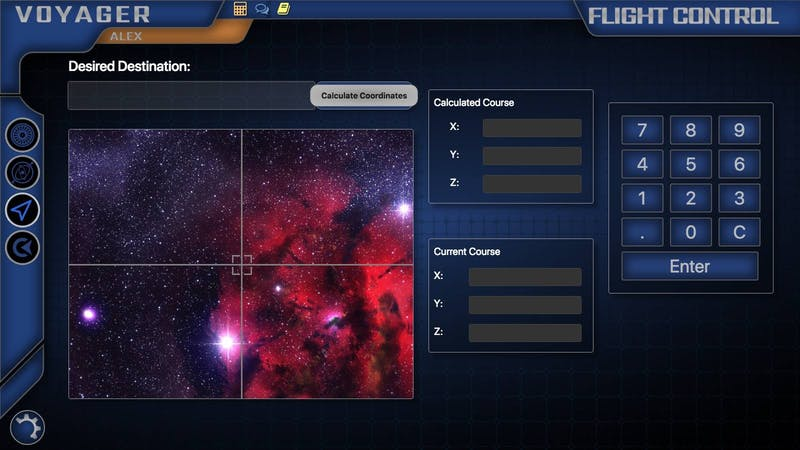
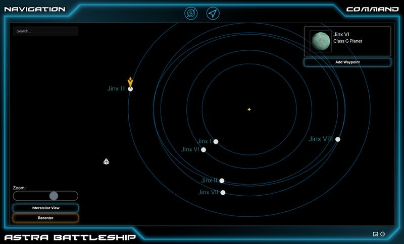
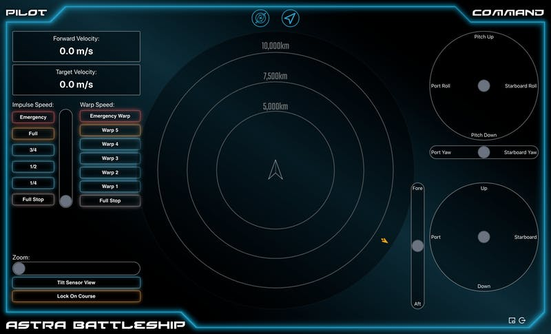
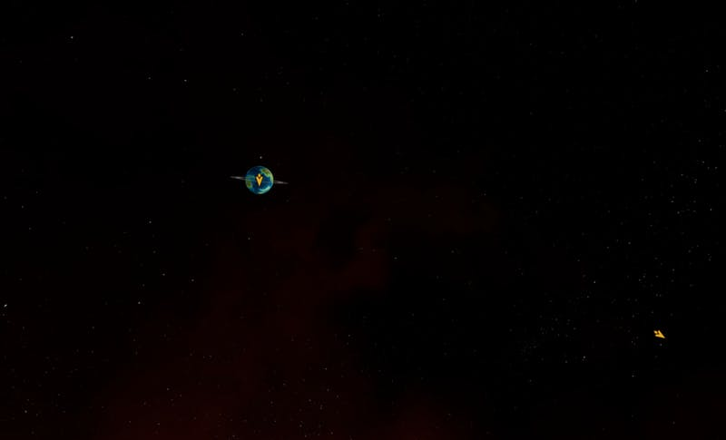

### Navigation Screen

I've begun work on a new screen used for navigation. The Flight Control screen that I showed last time only lets you go places, but how do you pick where to go? That's what this screen is for.

The Thorium Classic navigation screen looks something like this:

There are a number of problems with this:

- They have to type in the destination they want to go to, but cannot browse possible destinations.
- The "Calculated Course" gives them three random numbers, which has no consistency or realism.
- Typing in the numbers is boring, and isn't how you would actually set a course.
- They have no way of knowing where they are or how long it will take to get where they are going

I'm fixing all of those problems in Thorium Nova with the new Navigation screen. Check it out:

- You can see all of the possible destinations within the solar system, and can navigate anywhere in interstellar space too.
- Courses are set by setting waypoints (the little orange flag), and then using thrusters from the Flight Control screen to point the ship at the waypoint.
- They don't type in numbers anymore. Now, they find the destination by searching, or by looking on their map; they set a waypoint; they use their thrusters to point at the waypoint; and they activate their engines.
- They can see their position on the screen (the pyramid icon in on the lower left), and see how far it is to their destination. Eventually I'll add "Distance", "Recommended Speed", and "Travel Time" fields to the object info in the top-right corner to give them an even better idea of how to get where they want to go.

This screen is integrated with both the Flight Control screen and the Viewscreen. On the Flight Control screen, they can see the waypoint arrow pointing in the direction their ship needs to be pointing, so if it is directly ahead, they know they are going the right way (just make sure to tilt the screen to make sure the ship is lined up on the Y axis).

On the viewscreen, the waypoint arrow appears at the edge of the screen showing which direction the ship needs to turn. Notice the arrow right next to the planet, and another arrow pointing off towards an off-screen waypoint. By using the Viewscreen and the Flight Control screen together, the Flight Control officer can easily rotate the ship to make sure it's going the right way.

### Warp Engines

I've activated the Warp Engines, making it possible to travel faster than the speed of light. While it is absolutely possible to travel anywhere in the Thorium Nova universe using sub-light Impulse Engines, Warp Engines speed up the process considerably.

Warp Engines CAN be used in a solar system, and are absolutely necessary to get from the inner planets to the outer planets in short order. However, there is a "no-wake" zone within solar systems, limiting your maximum speed. Otherwise, you would easily crash. Once you cross the heliopause and enter interstellar space, your ship can travel much faster, enabling interstellar travel.

One thing that I've discovered as I've played with Warp Engines is that it is INCREDIBLY easy to crash, or miss your destination entirely, due to the high speeds and low precision. Because of this, I've decided that Thorium Nova will have an auto-pilot system. Once you use your thrusters to line up with a waypoint, you can click "Lock On Course". This will make slight adjustments to your course to line your ship up with precision that isn't humanly possible. It will also automatically slow your ship down as you approach your destination. This is also necessary to enter any solar system from Interstellar space, since Thorium Nova needs to know if you actually intend to enter a solar system, as opposed to passing right by it.

That being said, I still want to make it possible to change course while at Warp speed, so any adjustment of the thrusters will automatically disable the course lock. The image of changing course while at Warp speed is actually pretty spectacular.

### Other Adjustments

Newtonian physics fans will weep - I've removed Newtonian physics from the Impulse Engines. Getting the inertial dampeners to work correctly while remaining intuitive was an absolute pain, so I just decided to go the route of other spaceship simulators - treat the spaceship like an airplane. Whatever direction your ship is pointing is the direction you move forward. Once I made that small change, the controls were suddenly much more intuitive. Hopefully the hard sci-fi supporters will understand that I'm doing this in the name of fun and ease-of-use.
