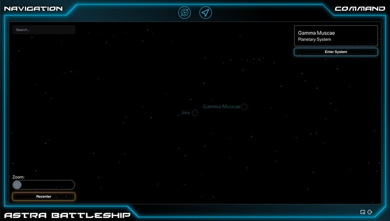

Work on the warp engines has progressed nicely, including some improvements to the warp stars effect. I've also been making progress on interstellar navigation. This next screen should look familiar.

I've replicated the appearance and behavior of the starmap editor, since it has such a nice look. However, I've simplified it by only making it a 2-dimensional projection instead of a fully 3-dimensional cloud. Hopefully that is sufficient to see and access each system, while keeping the player controls as simple as possible. Changing it back to 3-dimensional would not be hard if that ended up being necessary.

I've also implemented the function which makes a ship leave a solar system. There is an invisible boundary that lies just outside the orbit of the furthest planet in the system. Once any ship crosses that boundary, they'll be in interstellar space; their warp engines will operate at much faster speeds, so they can reach other systems in reasonable time, and they'll be able to travel to other systems.

Except they can't travel to other systems yet. That's a feature I still need to add. I guess it's back to work for me!
