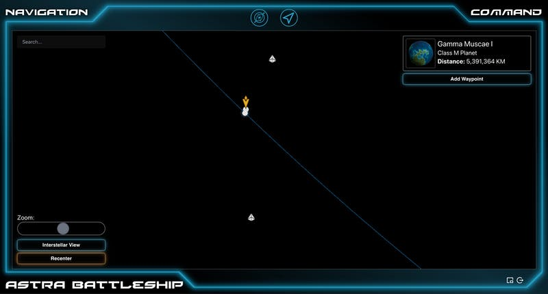
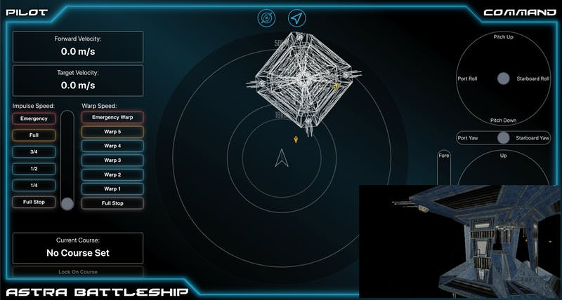

This past week has mostly been spent fixing issues involved in the transition between Planetary and Interstellar space. There's a lot of moving pieces that have to be orchestrated together to make it work right, so a few issues needed to be addressed. It's looking pretty good.
Bonus: I unintentionally created a sweet effect for entering a solar system that looks very similar to Star Wars. Here's their effect:

And here's Thorium Nova:

I've also added a distance field to the navigation screen, so you can know how far away objects are from the ship's position. In the planetary view, it shows kilometers; in the interstellar view it shows lightyears.

This next picture isn't showing off much that you haven't seen before. Using the navigation and some careful manipulation of the engines, I was able to navigate my ship to be in visual range to this starbase. It was difficult, because of the distances and speeds involved.

