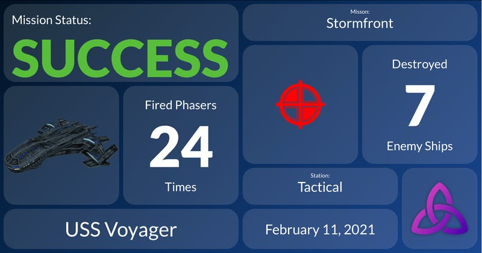

There has been very little progress since last week. I was able to fix a few bugs and get the initial workings of autopilot for the warp engines in place. I've gotta say, it's pretty incredible that Thorium Nova is already sophisticated enough to allow you to point your ship at a planet several lightyears away and it's able to get you there... granted, with a few missteps here and there. There's tuning to be done, but I'm convinced that the travel system that I've put together will work.

Remember that list of things that needs to be done from last week? Yeah, all of that is still in progress. I've run into a bit of a wall with regard to motivation though. For those of you who have been with me for a few years, you know that I go through ups and downs, and this is no exception. I'll blame the weather/pandemic. I'm not too worried, though - hopefully within a week or two, I'll be feeling a bit more like myself and I'll dive back in.

In the meantime, I've started work on a new, related project: The new Thoriumsim.com. When Thorium Nova launches officially, it's going to take over the main thoriumsim.com website while all of the existing content moves to [classic.thoriumsim.com](https://classic.thoriumsim.com).

I need a new site to support many of the features that I plan on building into Thorium Nova, including the Thorium Emporium, a marketplace to buy and sell plugins for Thorium Nova. I'm also planning on adding a social aspect, where you can connect with "your crew" to decide when you want to fly a flight. You'll be able to link it with your Discord account to get special privileges on the Discord server. It will also collect and store statistics about every flight for each of the crew members, making it possible to track your rank advancements and share summaries of your flights on social media, like so:

That's all not coming for a very long time, though. For right now, I'm starting on the foundation of the new site and building out a new issue tracker. Those who have used Thorium Classic might have noticed the helpful form that lets you tell me if there is a problem or if there is a feature you would like added. For as much stress and anxiety that form gives me, it's one of my favorite features of Thorium - it gives me direct insights into how Thorium is working for you and helps me to make it continually better.

The platform that I built that issue tracker on is meant for developers, not spaceship enthusiasts. And while it's worked well enough, one of the things I wish the issue tracker supported was having conversations inline with the issue itself, instead of relying on email to get more information. Also, the attachment upload feature never really worked.

My intention is to recreate this issue tracker platform, but make it customized to the needs of Thorium users. You'll still be able to submit issues just using your email, but with a Thorium Account you'll also be able to participate in the conversation. Signed in visitors will be able to see all of the existing bugs and feature requests on the website, and upvote any that they are most excited about. That will help me gauge interest in certain features as I move forward.

I can also link this issue tracker to the automated release system, so once your issue is fixed and released, you can get an email telling you which version of Thorium includes your requested feature or bug fix.

It may seem kind of strange that I'm more excited about a glorified task manager than a spaceship simulator game, but having this minor distraction will help me stay sharp and engaged with the project. Plus, this is a prerequisite for releasing an alpha version later this year, so getting this done gets us one step closer to that.
