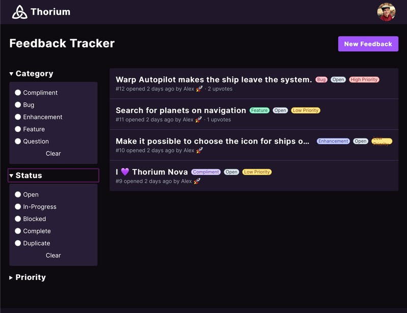
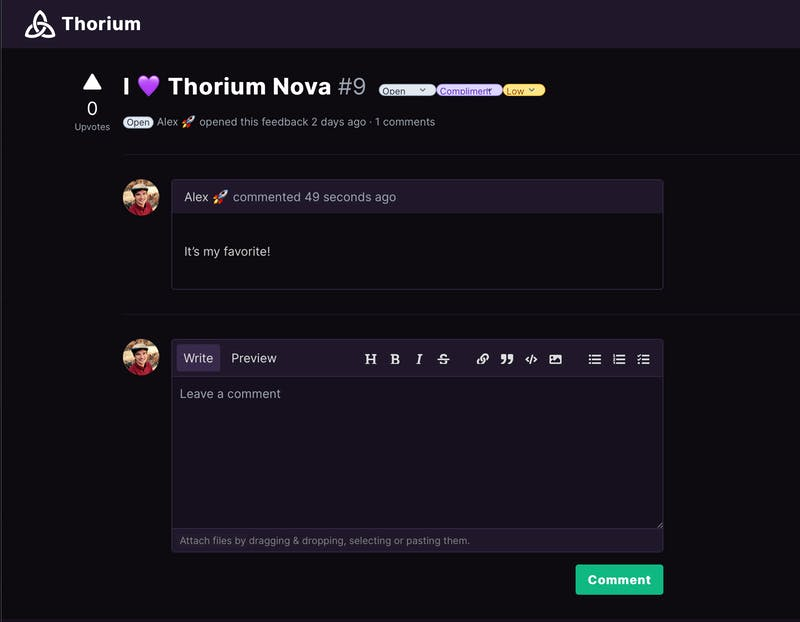

Like I mentioned last week, I wanted a bit of a diversion from the usual work on Thorium Nova, so I started building the new thoriumsim.com and setting up the feedback tracker. Progress has gone really well. The user account system is in place, and I've got most of the scaffolding for the issue tracking system in place.

Like before, you can choose a priority and a category for the feedback, including a new "Compliment" category to send some good vibes my way. You'll be able to see the current status as well. An upcoming feature will allow you to filter the feedback to items you've submitted.

On the page for each individual feedback item, you'll be able to join the conversation as I work on each feedback item. People can upvote feedback to give me a better idea of what things people want to have done sooner. The message input provides rich-text input using [markdown](https://guides.github.com/features/mastering-markdown/), and supports image uploads if you need to provide a screenshot.

Outside of a few bug fixes, I also need to integrate email into this, making it so you get emails when issues that you follow get new comments or are completed. Of course, this also means email notification preferences need to be put in place. I also want to make it possible to respond to feedback by replying to emails.

Then there also needs to be an integration into Thorium Nova, where users can open up the feedback form from any screen, including crew stations. This makes it much easier to log issues affecting all aspects of Thorium Nova.
